# Introduction

Welcome to our comprehensive guide on configuring Identity Provider (IdP) for users and groups synchronization. This document provides step-by-step instructions and best practices for setting up and managing your synchronization processes effectively.

## Google WorkSpace

Before you start creating and configuring an Google Workspace application, ensure that you have the following:
- User account with admin permissions: You must have an Google Workspace user account with the admin permissions to create and manage Google Workspace applications. If you don't have the required permissions, ask your workspace administrator to grant them to you.
- Create new `NetBird` project in Google cloud console https://console.cloud.google.com.
- Enable `Admin SDK API` for `Netbird` project at https://console.cloud.google.com/apis/library/admin.googleapis.com.

#### Step 1: Create a service account
- Navigate to [API Credentials](https://console.cloud.google.com/apis/credentials) page
- Click `CREATE CREDENTIALS` at the top and select `Service account`
- Fill in the form with the following values and click `CREATE`
  - Service account name: `NetBird`
  - Service account ID: `netbird`
- Click `DONE`

    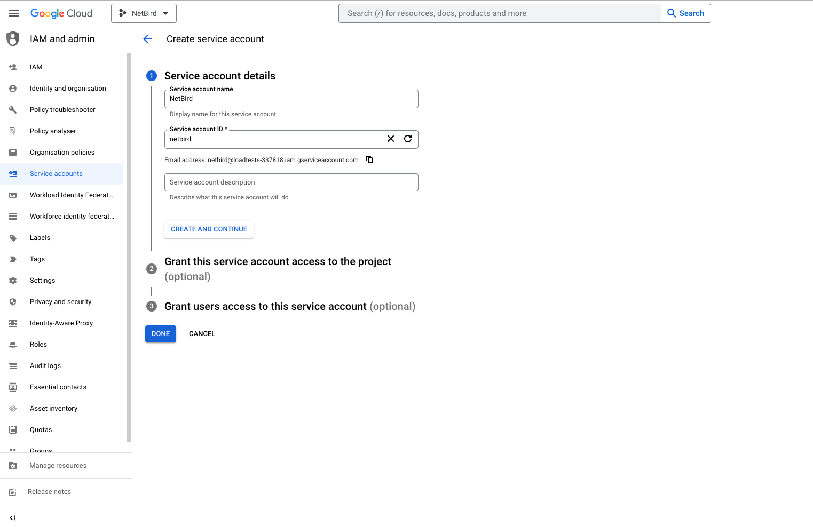

#### Step 2: Create service account keys
- Navigate to [API Credentials](https://console.cloud.google.com/apis/credentials) page
- Under  `Service Accounts` click the `NetBird` to edit the service account

    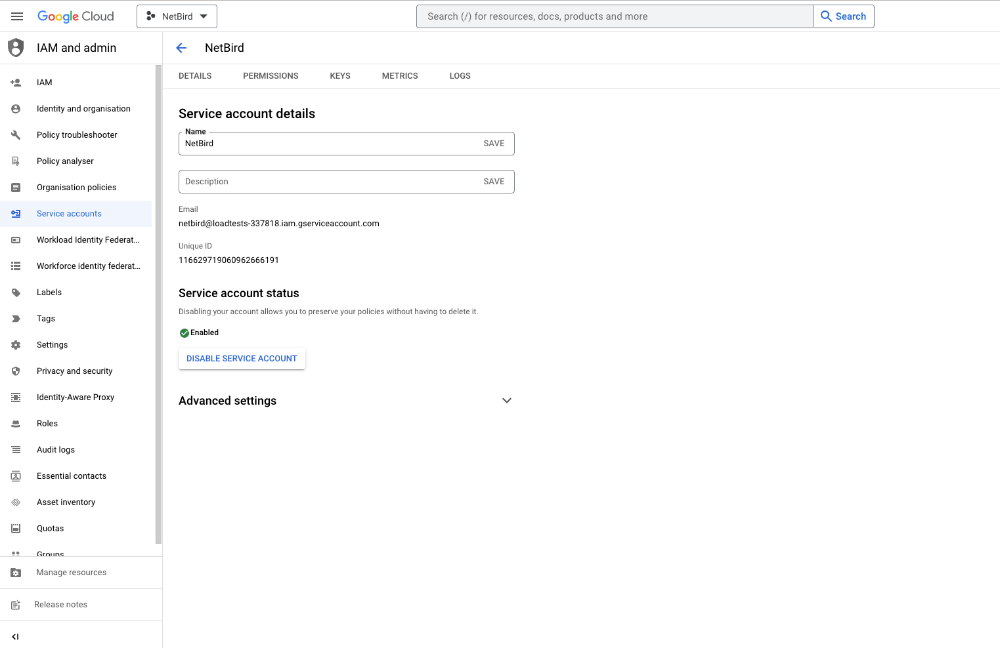

- Take note of service account email address, we will use it in next steps
- Click the `Keys` tab
- Click the `Add key` drop-down menu, then select `Create new key`
- Select `JSON` as the Key type and click `Create`

>When you create a service account key by using the Google Cloud console, most browsers immediately download the new key and save it in a download folder on your computer.
Read how to manage and secure your service keys [here](https://cloud.google.com/iam/docs/best-practices-for-managing-service-account-keys#temp-locations)

#### Step 3: Grant a user management admin role to a service account
- Navigate to [Admin Console](https://admin.google.com/ac/home) page
- Select `Account` on the left menu and then click `Admin Roles`
- Click `Create new role`
- Fill in the form with the following values and click `CREATE`
  - name: `User and Group Management ReadOnly`
  - description: `User and Group Management ReadOnly`
- Click `CONTINUE`

    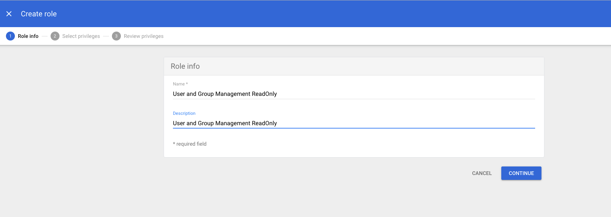

- Scroll down to `Admin API privileges` and add the following privileges
  - Users: `Read`
  - Groups: `Read`

    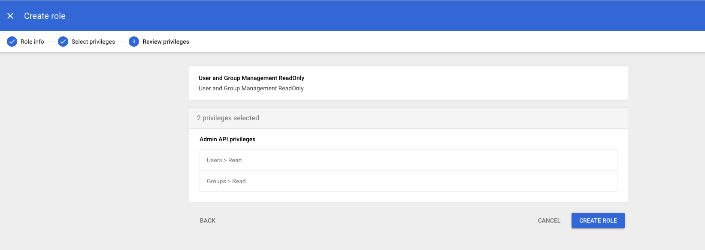

- Verify preview of assigned Admin API privileges to ensure that everything is properly configured, and then click `CREATE ROLE`

- Click `Assign service accounts`, add service account email address and then click `ADD`

    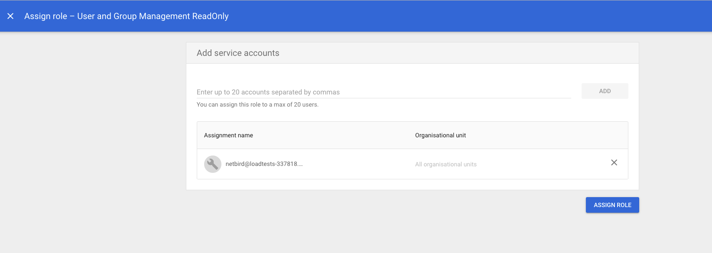

- Click `ASSIGN ROLE` to assign service account to `User and Group Management ReadOnly` admin role

    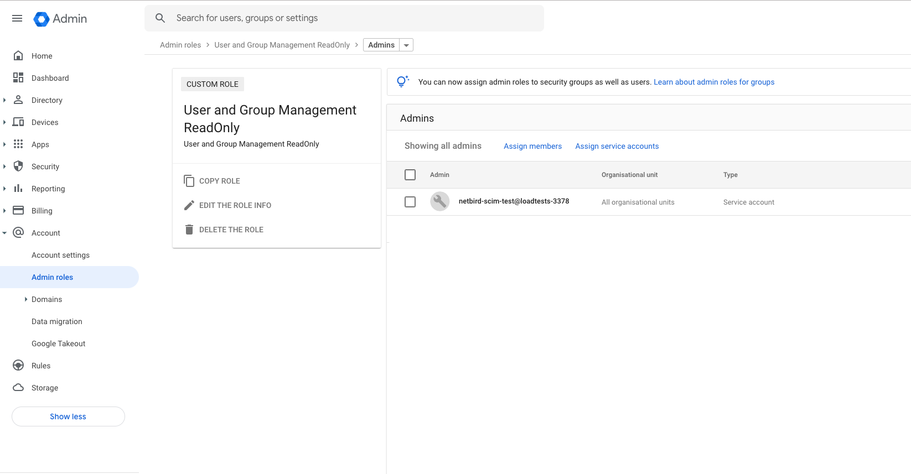

- Navigate to [Account Settings](https://admin.google.com/ac/accountsettings/profile?hl=en_US) page and take note of `Customer ID`

## Azure AD

Before you start creating and configuring an Azure AD application, ensure that you have the following:
- User account with admin permissions: You must have an Azure AD user account with the appropriate permissions to create
  and manage Azure AD applications. If you don't have the required permissions, ask your Azure AD administrator to grant them to you.

#### Step 1. Create and configure Azure AD application
- Navigate to [Azure Active Directory](https://portal.azure.com/#view/Microsoft_AAD_IAM/ActiveDirectoryMenuBlade/~/Overview)
- Click `App Registrations` in the left menu then click on the `+ New registration` button to create a new application.
- Fill in the form with the following values and click `Register`
  - Name: `NetBird`
  - Account Types: `Accounts in this organizational directory only (Default Directory only - Single tenant)`
  - Redirect URI: select `Single-page application (SPA)` and URI as `https://app.netbird.io/silent-auth`

    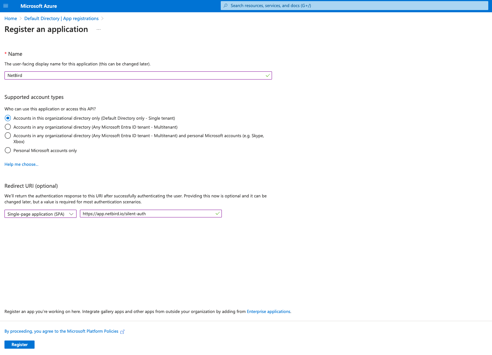

#### Step 2. Platform configurations
- Click `Authentication` on the left side menu
- Under the `Single-page application` Section, add another URI `https://app.netbird.io/auth` and click `Save`

    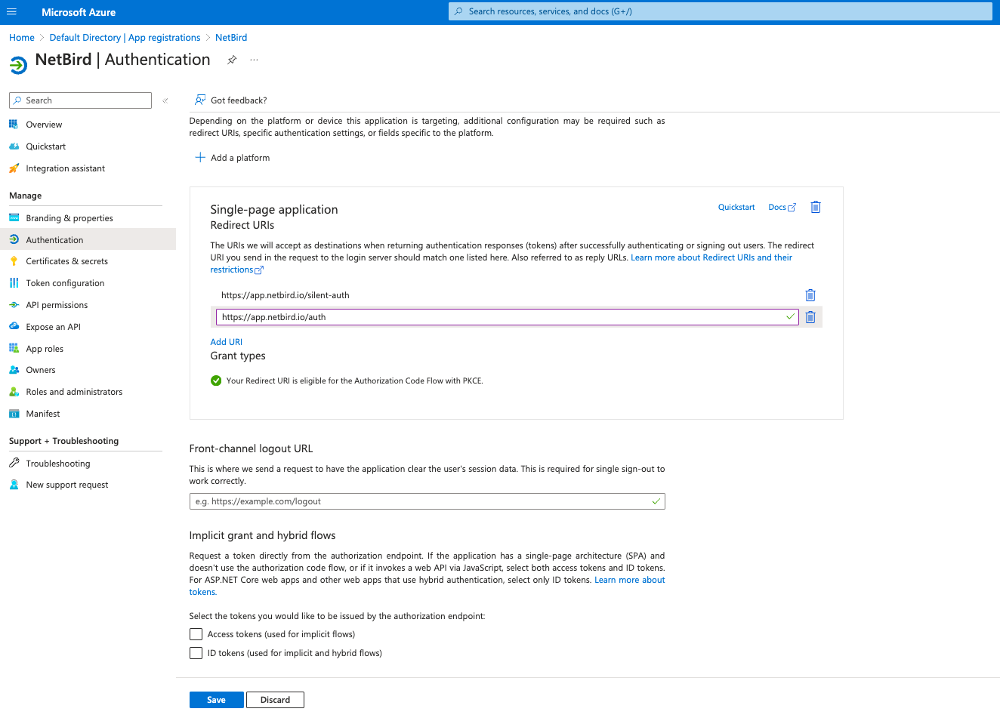

#### Step 3. Create a NetBird application scope
- Click `Expose an API` on the left menu
- In `Application ID URI` click `Add` and then `Save`

    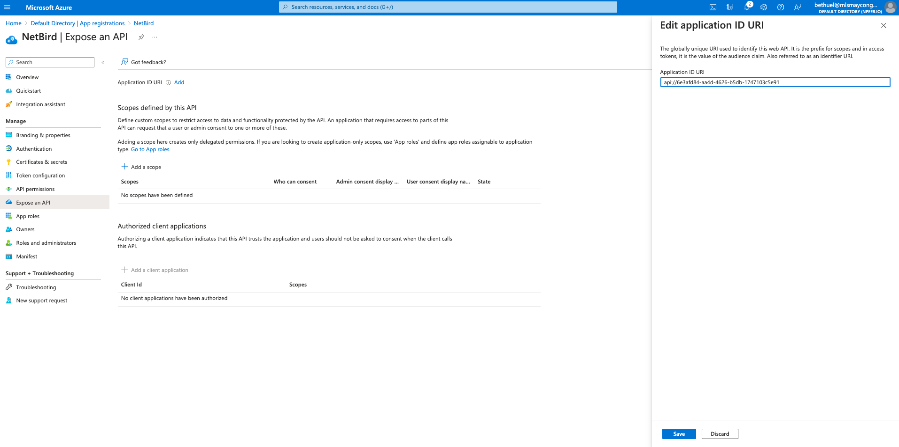

- Under `Scopes defined by this API` click `+ Add a Scope`
- Fill in the form with the following values and click `Add scope`
  - Scope name: `api`
  - State: `Enabled`

    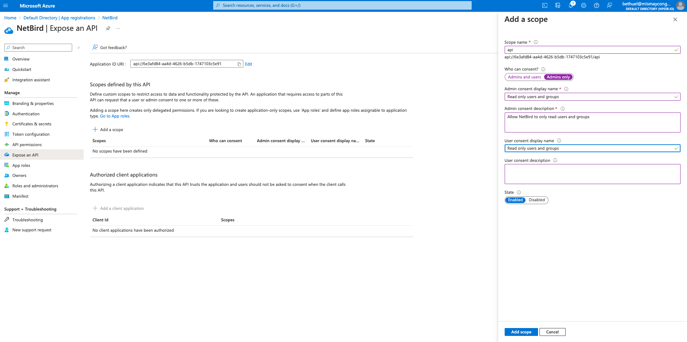

- Under `Authorized client Applications`, click on `+ add a client application` and enter the following:
- Fill in the form with the following values and click `Add application`
- Client ID: same as your Application ID URI minus the `api://`

    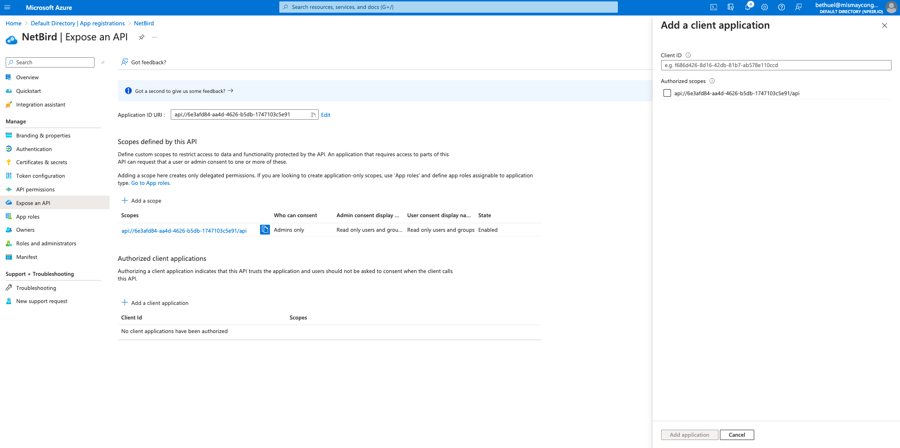

#### Step 4. Add API permissions

- Click `API permissions` on the left menu
- Click `Add a permission`
- Click `Microsoft Graph` and then click `Application permissions` tab
- In `Select permissions` select `User.Read.All` and `Group.Read.All` and click  `Add permissions`

    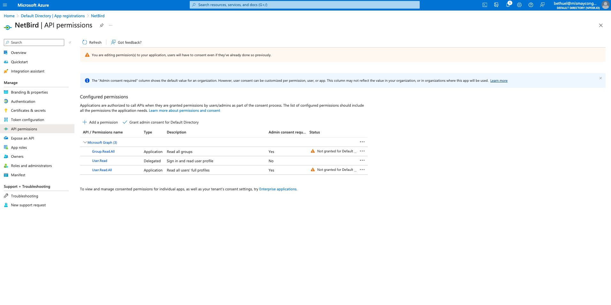

 

- Click `Grant admin conset for Default Directory` and click `Yes`

    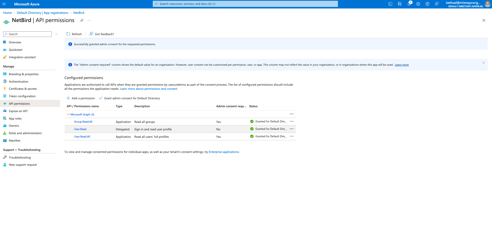

#### Step 5. Update token version
- Click `Manifest` on left menu
- Search for `accessTokenAcceptedVersion` and change the value from `null` to `2`
- Click `Save`

#### Step 6. Generate client secret
- Click `Certificates & secrets` on left menu
- Click `New client secret`
- Fill in the form with the following values and click `Add`
- Description: `NetBird`
- Copy `Value` and save it as it can be viewed only once after creation.

    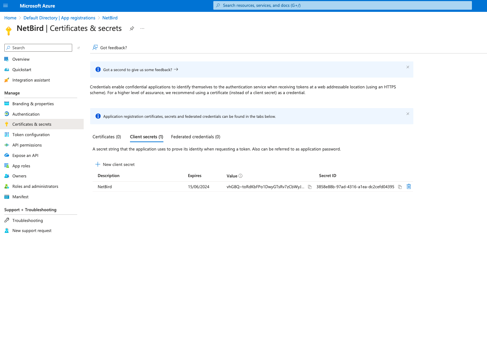

- Navigate to [Owner applications](https://portal.azure.com/#view/Microsoft_AAD_IAM/ActiveDirectoryMenuBlade/~/RegisteredApps).
- Select `NetBird` application in overview page, take note of `Application (client) ID` and `Directory (tenant) ID`.