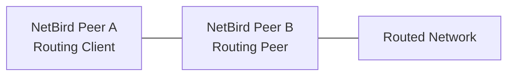

# Configuring Routes with Access Control

<Note>
    This feature is available from NetBird version 0.30.0 onwards.
</Note>

By default, network routes allow unrestricted access, meaning any traffic can
flow through the routes without limitations. This behavior occurs when access
control groups are not associated with a route. 

However, when access control groups are set, the route inherits access restrictions based on the defined
policies. Only traffic that meets the criteria specified in these policies can
access the internal services. This ensures that your network remains secure and that
only authorized users can reach sensitive resources.

## Route Access Policies and Access Control Groups

Route access policies are unidirectional, applying only from the routing
client to the routing peer. Consequently, the access control group only takes effect
when used as a destination group in the policy.

If an empty group (containing no peers) is used for the access control group
(and subsequently in the policy), then only the routed network will be affected
by the access policy, not the routing peer itself.

<Note>
    If an access control group was applied to the route but no route access policies are
    enabled or none exist, all routed traffic will be dropped.
    This contrasts with scenarios where no access control group is applied, in
    which case all traffic is permitted.
</Note>

## Creating a Network Route with Access Control Group
Since release `0.30.0`, the management service and dashboard support access control groups for network routes.

To add a Network Route with access control groups, access the `Network Routes` tab and click the `Add Route` button to create a new route.

In the example below, we are creating a route with the following information
(see [Concepts](/manage/network-routes/routing-traffic-to-private-networks#concepts) to learn more about the fields):

- Network identifier: `aws-eu-central-1-vpc`
- Description: `Production VPC in Frankfurt`
- Network range: `10.10.0.0/16`
- Routing peer: `server`
- Distribution Groups: `devs`
- Access Control Groups: `servers`

    

Click on `Continue` to proceed.

    

Once you fill in the route information, you can click on the `Add Route` button to save your new route.

    

Because you used an access control group, you will be prompted to create a new policy.

    

Click on the `Create Policy` button to proceed.

## Creating an Access Control Policy
If you did not use the prompt, you can create a new policy by accessing the `Access Control` > `Policies` tab, then clicking the `Add policy` button to create a new policy.

In the popup, specify source and destination groups, and add Posture Checks if needed. Make sure to set traffic
direction only when TCP or UDP protocols are selected. Finally, provide a name and description for your policy.

In the example below, we are creating a unidirectional policy with the following information:
- Name: `Devs to Servers`
- Description: `Devs are allowed to access servers`
- Protocol: `TCP`
- Ports: `80`
- Source Groups: `devs`
- Destination Groups: `servers`

    

If necessary, you can create new groups by entering new names in the input box for either the source or destination lists.

Once you have finished configuring the policy, click `Add Policy` to save it. You will then see your new policy in the table.

    

The route has been created successfully. Now, every peer connected to your routing peer can only access port 80 services on the routed network,
as specified by the defined policy.

## Site-to-Site Traffic Configuration

For site-to-site traffic, where routes are set up in both directions with one
peer in the distribution group and the other as the routing peer (and vice
versa), there are two configuration scenarios:

### With Masquerading Enabled

To subject site-to-site traffic to route access policies, ensure masquerading
is enabled. You'll need to set up two policies, one for each direction/site.

### Without Masquerading

If masquerading is disabled, access control groups need not be applied.
This configuration allows unrestricted access in both directions.

Choose the appropriate configuration based on your security requirements and
network setup.

## Behavior Changes in Version 0.30.0

Prior to version 0.30.0, routing clients would accept any traffic initiated from
routed networks behind routing peers. From version 0.30.0 onwards, routing
clients only accept return traffic for connections initiated by routing clients.

To illustrate this change, consider the following example:

Pre-0.30.0: Peer A would accept connections initiated from the Routed Network
through Peer B.

Post-0.30.0: Peer A only accepts return traffic for connections it initiates to
the Routed Network through Peer B.

To allow traffic initiated from the routed network in version 0.30.0 and later:

1. Ensure masquerade is enabled for the route.
2. Add a peer access policy to allow specific traffic from the routing peer to
   the routing client. This is required whether route access policies are set up
   or not. The traffic flow should be:
   Routing Client (Peer A) ← Routing Peer (Peer B)

This configuration allows the routing client (Peer A) to accept incoming traffic
from the routing peer (Peer B), which may originate from the routed network.