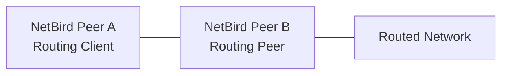

# Configuring Routes with Access Control

<Note>
    This feature requires NetBird version 0.30.0 or later.
</Note>

By default, network routes allow unrestricted access when no access control groups are assigned. When you assign access control groups to a route, only traffic that matches the defined policies can access the routed network.

## How Route Access Policies Work

Route access policies are unidirectional and apply only from routing clients to routing peers. The access control group takes effect only when used as a destination group in a policy.

If you assign an empty group (one containing no peers) as the access control group, only the routed network is affected by the policy, not the routing peer itself.

<Note>
    If you assign an access control group to a route but no route access policies exist or are enabled, all routed traffic will be dropped. This differs from routes without an access control group, which permit all traffic.
</Note>

## Creating a Network Route with Access Control

To create a network route with access control groups, navigate to **Network Routes** and click **Add Route**.

In this example, we create a route with the following settings (see [Key Concepts](/manage/network-routes#key-concepts) for field descriptions):

- **Network identifier:** `aws-eu-central-1-vpc`
- **Description:** `Production VPC in Frankfurt`
- **Network range:** `10.10.0.0/16`
- **Routing peer:** `server`
- **Distribution Groups:** `devs`
- **Access Control Groups:** `servers`

    

Click **Continue** to proceed.

    

Complete the configuration and click **Add Route** to save.

    

Because you assigned an access control group, you will be prompted to create a policy:

    

Click **Create Policy** to continue.

## Creating an Access Control Policy

If you skipped the prompt, navigate to **Access Control** > **Policies** and click **Add policy**.

Specify source and destination groups, configure protocol settings, and add Posture Checks if needed. Traffic direction applies only when TCP or UDP is selected.

In this example, we create a policy with:

- **Name:** `Devs to Servers`
- **Description:** `Devs are allowed to access servers`
- **Protocol:** `TCP`
- **Ports:** `80`
- **Source Groups:** `devs`
- **Destination Groups:** `servers`

    

You can create new groups by typing a name in the source or destination input fields.

Click **Add Policy** to save. The policy appears in the table.

    

With this configuration, peers connected to your routing peer can only access port 80 on the routed network.

## Site-to-Site Traffic Configuration

For site-to-site traffic where routes exist in both directions (with each peer serving as both a distribution group member and a routing peer), configuration depends on masquerading:

### With Masquerading Enabled

Enable masquerading to apply route access policies to site-to-site traffic. Create two policies, one for each direction.

### Without Masquerading

When masquerading is disabled, access control groups are not required. Traffic flows unrestricted in both directions.

Choose the configuration that matches your security requirements.

## Behavior Changes in Version 0.30.0

Before version 0.30.0, routing clients accepted any traffic initiated from routed networks. From version 0.30.0 onwards, routing clients only accept return traffic for connections they initiated.

**Example:**

- **Pre-0.30.0:** Peer A accepted connections initiated from the routed network through Peer B.
- **Post-0.30.0:** Peer A only accepts return traffic for connections it initiates.

To allow traffic initiated from the routed network in version 0.30.0 and later:

1. Enable masquerade for the route.
2. Add a peer access policy allowing traffic from the routing peer to the routing client (Peer B to Peer A). This is required whether or not route access policies exist.

This allows the routing client (Peer A) to accept incoming traffic from the routing peer (Peer B) that originates from the routed network.
