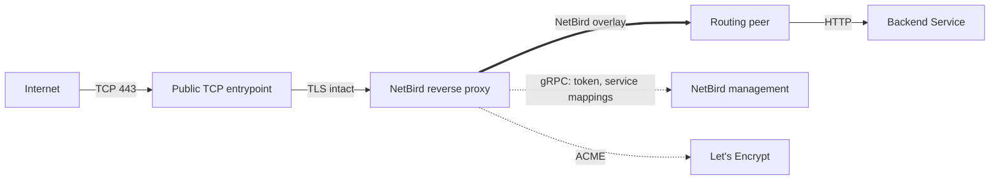
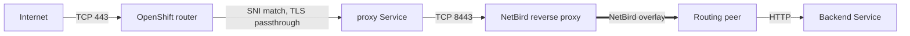

import {Note, Warning} from "@/components/mdx"

export const description =
    'Run the NetBird reverse proxy on Red Hat OpenShift with the rootless UBI image, automatic Let\'s Encrypt certificates, and either a TCP LoadBalancer or TLS-passthrough Routes for public exposure.'

# Reverse Proxy on OpenShift

This guide deploys the NetBird reverse proxy on OpenShift so an external client can reach a backend Service over the NetBird overlay. The proxy obtains and renews its own TLS certificates with ACME, runs under the stock `restricted-v2` security context constraint, and needs no custom SCC, privileged mode, host networking, or elevated capabilities.

It uses the rootless proxy image built on Red Hat Universal Base Image (UBI) 9 and published for Linux AMD64 and ARM64. The image runs as a non-root user and keeps its writable directories group-writable so OpenShift can assign an arbitrary UID. The manifest in [Step 2](#step-2-deploy-the-proxy) pins the image tag; pin a version or digest for reproducible deployments and see [NetBird releases](https://github.com/netbirdio/netbird/releases) for new versions.

By the end of this guide, the namespace contains:

| Resource | Name | Purpose |
|----------|------|---------|
| Secret | `netbird-proxy-config` | Proxy token, cluster domain, and management address |
| PersistentVolumeClaim | `netbird-proxy-certs` | ACME account key and issued certificates |
| Deployment | `netbird-proxy` | The NetBird reverse proxy, one replica |
| Service | `netbird-proxy` | `ClusterIP`, or `LoadBalancer` for the preferred exposure |
| Route | One per service hostname | Only for the TLS-passthrough fallback |
| Deployment and Service | `nginx-server` | Optional test backend |

## How it works

The proxy is an ordinary NetBird reverse proxy instance: it registers with your management server over gRPC, receives the service mappings for its cluster domain, requests a certificate from Let's Encrypt for each service hostname, terminates TLS, and forwards traffic through the NetBird overlay to a routing peer that reaches the backend Service.



Only the proxy is reachable from the Internet. The backend Service stays `ClusterIP` and is reached through the routing peer only.

The public TCP entrypoint must forward TCP 443 to the proxy **without terminating TLS**, so the proxy can answer the Let's Encrypt `tls-alpn-01` challenge and present the issued certificate itself. OpenShift offers two ways to do that. Decide which one applies to your cluster before you start, because it determines your DNS records and your ongoing work:

| | [TCP LoadBalancer](#preferred-exposure-a-tcp-load-balancer) (preferred) | [TLS-passthrough Routes](#fallback-without-a-load-balancer-tls-passthrough-routes) (fallback) |
|---|---|---|
| Requires | A LoadBalancer provider that allocates a publicly reachable address | The public OpenShift ingress router |
| DNS | Wildcard `CNAME` for service hostnames | Wildcard `CNAME` for service hostnames |
| Work per new service | None | Create one Route for the service hostname |
| Custom domains | DNS records only | DNS records and one Route per hostname |

## Prerequisites

Before you start, make sure you have:

- An OpenShift login with permission to create Deployments, Services, Secrets, PersistentVolumeClaims and, for the Route fallback, Routes in the target namespace. No additional SCC is needed.
- A default StorageClass that can provision a 1 GiB PVC.
- A **proxy access token** from your NetBird management server. This is not a client setup key or a personal access token:
  - **NetBird Cloud** - create an account-scoped token in the dashboard under **Reverse Proxy** > **Clusters** > **Setup Self-Hosted Cluster**, or through the API. See [Bring Your Own Proxy](/manage/reverse-proxy/bring-your-own-proxy). The management address is `https://api.netbird.io`.
  - **Self-hosted** - create a management-wide token with `netbird-server admin token create` (combined container) or `netbird-mgmt admin token create` (multi-container). See [Enable Reverse Proxy](/selfhosted/migration/enable-reverse-proxy). The management address is your management server's public URL. Because this proxy runs outside the management host's Docker network, the management server's Traefik must also route the `ProxyService` gRPC path and have its idle timeout disabled. Follow [Prepare the management server for cross-host proxies](/selfhosted/maintenance/scaling/multiple-proxy-instances#prepare-the-management-server-for-cross-host-proxies) first. This [Traefik requirement](/manage/reverse-proxy#traefik-requirement) applies to the management server, not to the proxy deployed here.
- Public DNS names you control, and inbound TCP 443 connectivity from the Internet to the proxy.
- Outbound access from the cluster to your NetBird management server, the configured signal and relay services, Let's Encrypt, and `pkgs.netbird.io`, from which the proxy downloads its geolocation database at startup.
- A NetBird routing peer that can reach the backend Service. [Step 4](#step-4-connect-a-backend) uses the rootless UBI client from the [OpenShift installation guide](/get-started/install/openshift) deployed in the same cluster.

<Note>
    If the namespace has a default-deny NetworkPolicy, allow egress from the proxy pod to DNS, the management server, signal, relays, Let's Encrypt, and `pkgs.netbird.io` on TCP 443. Also allow ingress to the proxy pod on TCP 8443: from the OpenShift router for the Route fallback (namespaces labeled `policy-group.network.openshift.io/ingress: ""`), or from the load balancer's source addresses for the preferred exposure. Allow the kubelet to reach TCP 8080 for the health probes if your policy restricts host-network traffic.
</Note>

The guide uses three values. Replace the examples with your own:

| Variable | Example | Purpose |
|----------|---------|---------|
| `NB_PROXY_DOMAIN` | `proxy.example.com` | The **cluster domain**. The proxy registers under this domain, and services are created as subdomains of it. It is also the value of the proxy's `NB_PROXY_DOMAIN` environment variable. |
| `NB_PROXY_MANAGEMENT_ADDRESS` | `https://netbird.example.com:443` | The management server that issued your token, `https://api.netbird.io` for NetBird Cloud. It is also the value of the proxy's `NB_PROXY_MANAGEMENT_ADDRESS` environment variable. |
| `SERVICE_HOSTNAME` | `nginx.proxy.example.com` | The **service hostname** users visit. Shell variable only; the proxy learns service hostnames from management. Here it is a subdomain of the cluster domain; a verified [custom domain](/manage/reverse-proxy/custom-domains) works the same way. |

Export them for the commands in this guide, then create the namespace:

```bash
export NB_PROXY_DOMAIN=proxy.example.com
export NB_PROXY_MANAGEMENT_ADDRESS=https://netbird.example.com:443
export SERVICE_HOSTNAME=nginx.proxy.example.com
export NAMESPACE=netbird-proxy

oc create namespace "$NAMESPACE" --dry-run=client -o yaml | oc apply -f -
```

## Step 1: Create the configuration Secret

The Deployment reads its token, cluster domain, and management address from a Secret named `netbird-proxy-config`. Create it with your proxy access token:

```bash
export NB_PROXY_TOKEN=nbx_replace_with_your_proxy_token

oc create secret generic netbird-proxy-config -n "$NAMESPACE" \
  --from-literal=proxy-token="$NB_PROXY_TOKEN" \
  --from-literal=proxy-domain="$NB_PROXY_DOMAIN" \
  --from-literal=management-address="$NB_PROXY_MANAGEMENT_ADDRESS" \
  --dry-run=client -o yaml | oc apply -f -
```

The command is safe to re-run to change a value. The proxy picks up changes only after a restart: `oc rollout restart deployment/netbird-proxy -n "$NAMESPACE"`.

## Step 2: Deploy the proxy

Self-issued ACME certificates and their account keys live on a single writable volume. The Deployment therefore runs one replica with the `Recreate` strategy, uses filesystem locking for the certificate cache, and mounts a PersistentVolumeClaim at `/certs` so the ACME account and issued certificates survive pod replacement.

Save the following as `netbird-proxy.yaml`. It needs no edits; every environment-specific value comes from the Secret, and the namespace comes from the `oc apply` command.

```yaml
apiVersion: v1
kind: PersistentVolumeClaim
metadata:
  name: netbird-proxy-certs
spec:
  accessModes:
    - ReadWriteOnce
  resources:
    requests:
      storage: 1Gi
---
apiVersion: apps/v1
kind: Deployment
metadata:
  name: netbird-proxy
  labels:
    app.kubernetes.io/name: netbird-proxy
spec:
  replicas: 1
  strategy:
    type: Recreate
  selector:
    matchLabels:
      app.kubernetes.io/name: netbird-proxy
  template:
    metadata:
      labels:
        app.kubernetes.io/name: netbird-proxy
    spec:
      automountServiceAccountToken: false
      securityContext:
        runAsNonRoot: true
        seccompProfile:
          type: RuntimeDefault
      containers:
        - name: proxy
          image: ghcr.io/netbirdio/reverse-proxy:0.80.0-ubi
          imagePullPolicy: IfNotPresent
          env:
            - name: NB_PROXY_TOKEN
              valueFrom:
                secretKeyRef:
                  name: netbird-proxy-config
                  key: proxy-token
            - name: NB_PROXY_DOMAIN
              valueFrom:
                secretKeyRef:
                  name: netbird-proxy-config
                  key: proxy-domain
            - name: NB_PROXY_MANAGEMENT_ADDRESS
              valueFrom:
                secretKeyRef:
                  name: netbird-proxy-config
                  key: management-address
            - name: NB_PROXY_ADDRESS
              value: :8443
            - name: NB_PROXY_HEALTH_ADDRESS
              value: :8080
            - name: NB_PROXY_ACME_CERTIFICATES
              value: "true"
            - name: NB_PROXY_ACME_CHALLENGE_TYPE
              value: tls-alpn-01
            - name: NB_PROXY_CERTIFICATE_DIRECTORY
              value: /certs
            - name: NB_PROXY_CERT_LOCK_METHOD
              value: flock
            - name: NB_PROXY_SUPPORTS_CUSTOM_PORTS
              value: "false"
          ports:
            - name: https
              containerPort: 8443
            - name: health
              containerPort: 8080
          securityContext:
            allowPrivilegeEscalation: false
            capabilities:
              drop:
                - ALL
          startupProbe:
            httpGet:
              path: /healthz/startup
              port: health
            periodSeconds: 5
            timeoutSeconds: 3
            failureThreshold: 60
          readinessProbe:
            httpGet:
              path: /healthz/ready
              port: health
            periodSeconds: 10
            timeoutSeconds: 3
          livenessProbe:
            httpGet:
              path: /healthz/live
              port: health
            periodSeconds: 10
            timeoutSeconds: 3
          resources:
            requests:
              cpu: 100m
              memory: 256Mi
          volumeMounts:
            - name: certificates
              mountPath: /certs
      volumes:
        - name: certificates
          persistentVolumeClaim:
            claimName: netbird-proxy-certs
---
apiVersion: v1
kind: Service
metadata:
  name: netbird-proxy
  labels:
    app.kubernetes.io/name: netbird-proxy
spec:
  type: ClusterIP
  selector:
    app.kubernetes.io/name: netbird-proxy
  ports:
    - name: https
      port: 443
      targetPort: https
```

Apply it and wait for the rollout:

```bash
oc apply -n "$NAMESPACE" -f netbird-proxy.yaml
oc rollout status deployment/netbird-proxy -n "$NAMESPACE" --timeout=5m
```

The Service is `ClusterIP` on purpose. [Step 3](#step-3-expose-the-proxy) either switches it to `LoadBalancer` or leaves it internal and puts Routes in front of it.

<Note>
    On OpenShift, leave `runAsUser`, `runAsGroup`, and `fsGroup` unset. The `restricted-v2` admission applies the namespace's allowed identity and volume group for you, and the image is built to work under that arbitrary UID.
</Note>

**Checkpoint.** The startup probe passes only after the proxy has connected to management and completed its initial mapping sync, so a finished rollout confirms the token and management address are correct. Check the PVC and the logs:

```bash
oc get pvc netbird-proxy-certs -n "$NAMESPACE"
oc logs deployment/netbird-proxy -n "$NAMESPACE" --tail=50
```

The PVC is `Bound`, the logs contain `Initial mapping sync complete`, and the cluster appears in the dashboard under **Reverse Proxy** > **Clusters** with an **Online** badge. If the rollout times out, see [Troubleshooting](#troubleshooting).

### Configuration explained

| Setting | Why |
|---------|-----|
| `replicas: 1` and `strategy: Recreate` | One process owns the certificate cache on the PVC. A rolling update would briefly run two writers against the same volume. See [Running more than one replica](#running-more-than-one-replica). |
| `NB_PROXY_CERT_LOCK_METHOD=flock` | Filesystem locking on the PVC. The `auto` default may select the Kubernetes lease backend, which needs a service account with lease RBAC. This Deployment mounts no service account token. |
| `NB_PROXY_ADDRESS=:8443` | The proxy listens on an unprivileged port. The Service maps port 443 to it. |
| `NB_PROXY_HEALTH_ADDRESS=:8080` | Binds the health endpoint to all interfaces so kubelet can reach the startup, readiness, and liveness probes. The same endpoint serves [Prometheus metrics](/selfhosted/observability/proxy). |
| `NB_PROXY_ACME_CERTIFICATES=true` and `NB_PROXY_ACME_CHALLENGE_TYPE=tls-alpn-01` | The proxy issues and renews certificates itself over port 443. Port 80 is not required. `tls-alpn-01` issues certificates for individual hostnames, not wildcards. See [TLS-ALPN-01 requirements](/manage/reverse-proxy#tls-alpn-01-requirements) and, if you need `http-01`, [Using http-01 instead of tls-alpn-01](#using-http-01-instead-of-tls-alpn-01). |
| `NB_PROXY_CERTIFICATE_DIRECTORY=/certs` on a PVC | Retains the ACME account key and certificates across pod replacement. Keep the PVC; deleting it forces fresh issuance and counts against Let's Encrypt rate limits. |
| `NB_PROXY_SUPPORTS_CUSTOM_PORTS=false` | Neither the Service nor the Routes expose arbitrary TCP or UDP ports, so the cluster does not advertise the **Custom Ports** capability. |
| `automountServiceAccountToken: false` and `capabilities: drop: [ALL]` | The proxy needs no Kubernetes API access and no Linux capabilities. |

For the full list of variables, see the [environment variable reference](/selfhosted/migration/enable-reverse-proxy#environment-variable-reference).

## Step 3: Expose the proxy

Pick the option you chose in [How it works](#how-it-works). In both cases, public TCP 443 must reach the proxy's port 8443 for the initial certificate issuance as well as every renewal.

### Preferred exposure: a TCP LoadBalancer

If your cluster has a LoadBalancer provider, change the Service type. No Route is needed in this mode:

```bash
oc patch service netbird-proxy -n "$NAMESPACE" -p '{"spec":{"type":"LoadBalancer"}}'
oc get service netbird-proxy -n "$NAMESPACE"
```

A working provider allocates an externally reachable address in the `EXTERNAL-IP` column and forwards TCP 443 to the proxy as plain TCP. A cloud network load balancer or MetalLB with public routing both qualify. MetalLB alone does not make a private address reachable from the Internet.

Point the cluster domain at the provisioned address with an `A`/`AAAA` record for an IP, or a `CNAME` for a load balancer hostname. Then point the service hostnames at the cluster domain with a wildcard `CNAME`:

| Record type | Name | Value |
|-------------|------|-------|
| `A` or `CNAME` | `proxy.example.com` | The load balancer's IP or hostname |
| `CNAME` | `*.proxy.example.com` | `proxy.example.com` |

Publish an `AAAA` record only if the IPv6 path also works end to end. The NetBird proxy routes by the hostname in the TLS handshake and handles every configured service hostname itself, so new services need no further OpenShift changes.

**Checkpoint.** `EXTERNAL-IP` shows an address instead of `<pending>`, and `dig "$SERVICE_HOSTNAME"` resolves to it.

### Fallback without a LoadBalancer: TLS-passthrough Routes

If the cluster has no LoadBalancer provider, use the existing public OpenShift ingress router instead. Leave the `netbird-proxy` Service as `ClusterIP`. If you already switched it to `LoadBalancer` and `EXTERNAL-IP` stayed `<pending>`, switch it back:

```bash
oc patch service netbird-proxy -n "$NAMESPACE" -p '{"spec":{"type":"ClusterIP"}}'
```

The OpenShift router picks a backend by matching the Route's hostname against the SNI in the TLS handshake, not by Service name. **Every service hostname NetBird knows about therefore needs its own Route with TLS passthrough, pointing at the proxy Service.** It is one Route per hostname, not one Kubernetes Service per hostname.



Create the Route for the example service hostname:

```bash
oc create route passthrough nginx-proxy -n "$NAMESPACE" \
  --hostname="$SERVICE_HOSTNAME" \
  --service=netbird-proxy \
  --port=https
```

The equivalent manifest, applied with `oc apply -n "$NAMESPACE" -f`:

```yaml
apiVersion: route.openshift.io/v1
kind: Route
metadata:
  name: nginx-proxy
spec:
  host: nginx.proxy.example.com
  to:
    kind: Service
    name: netbird-proxy
  port:
    targetPort: https
  tls:
    termination: passthrough
```

Then configure DNS. The cluster domain points at the public OpenShift ingress endpoint, and the service hostnames point at the cluster domain:

| Record type | Name | Value |
|-------------|------|-------|
| `CNAME` | `proxy.example.com` | The router's public endpoint, for example `router-default.apps.<cluster>.example.com` |
| `CNAME` | `*.proxy.example.com` | `proxy.example.com` |

DNS gets the connection to the router. The Route's hostname match gets it from the router to the NetBird proxy. A `CNAME` does not change the hostname sent in the TLS handshake, so the Route must match the service hostname exactly. A Route for the bare cluster domain or for a parent domain does not match `nginx.proxy.example.com`.

<Warning>
    Use `passthrough` termination only. With `edge` or `reencrypt`, the router terminates TLS, clients receive the cluster's wildcard certificate, and the `tls-alpn-01` challenge never completes.
</Warning>

**Checkpoint.** The router admitted the Route:

```bash
oc get route nginx-proxy -n "$NAMESPACE" \
  -o jsonpath='{range .status.ingress[*].conditions[*]}{.type}={.status}: {.message}{"\n"}{end}'
```

The output shows `Admitted=True`, and `dig "$SERVICE_HOSTNAME"` resolves to the router's public endpoint.

#### Adding more services

Each service you add in NetBird later, including services on a custom domain, needs its own Route before its certificate can be issued. Create it with a unique name, keeping `--service=netbird-proxy --port=https`:

```bash
oc create route passthrough app-proxy -n "$NAMESPACE" \
  --hostname=app.proxy.example.com \
  --service=netbird-proxy \
  --port=https
```

If a Route for the hostname already exists, update it rather than creating a duplicate.

## Step 4: Connect a backend

The backend proves end-to-end connectivity. It should be reachable only through the proxy and the NetBird overlay, never directly from the Internet.

### Deploy a test backend

Deploy an unprivileged nginx listening on port 8080, fronted by a `ClusterIP` Service named `nginx-server` that maps HTTP port 80 to the container's port 8080. Save it as `nginx-server.yaml` and apply it with `oc apply -n "$NAMESPACE" -f nginx-server.yaml`. Keep this Service internal; the public entrypoint targets the NetBird proxy, not nginx.

```yaml
apiVersion: apps/v1
kind: Deployment
metadata:
  name: nginx-server
spec:
  replicas: 1
  selector:
    matchLabels:
      app: nginx-server
  template:
    metadata:
      labels:
        app: nginx-server
    spec:
      automountServiceAccountToken: false
      securityContext:
        runAsNonRoot: true
        seccompProfile:
          type: RuntimeDefault
      containers:
        - name: nginx
          image: docker.io/nginxinc/nginx-unprivileged:stable-alpine
          ports:
            - name: http
              containerPort: 8080
          securityContext:
            allowPrivilegeEscalation: false
            readOnlyRootFilesystem: true
            capabilities:
              drop: [ALL]
          readinessProbe:
            httpGet:
              path: /
              port: http
          resources:
            requests:
              cpu: 10m
              memory: 16Mi
            limits:
              memory: 64Mi
          volumeMounts:
            - name: tmp
              mountPath: /tmp
      volumes:
        - name: tmp
          emptyDir: {}
---
apiVersion: v1
kind: Service
metadata:
  name: nginx-server
spec:
  type: ClusterIP
  selector:
    app: nginx-server
  ports:
    - name: http
      port: 80
      targetPort: http
```

### Add the backend to NetBird

The proxy reaches the backend through a routing peer, so the backend has to exist as a network resource first:

1. **Deploy a routing peer** in the cluster. Follow [OpenShift Installation](/get-started/install/openshift) to run the rootless UBI client, preferably with a [persistent peer identity](/get-started/install/openshift#persistent-peer-identity) so the routing peer assignment survives restarts.
2. **Create a network and a domain resource** with the address `nginx-server.netbird-proxy.svc.cluster.local` (replace `netbird-proxy` if you changed `NAMESPACE`), and assign the UBI client as its routing peer. Any pod in the cluster can resolve and reach this Service. See [Networks](/manage/networks).
3. **Add an access policy** that lets the proxy's embedded peer reach the resource. The proxy joins your NetBird network as a peer when it receives its first service mapping. See [Access Control](/manage/access-control/manage-network-access).
4. **Create the reverse proxy service** under **Reverse Proxy** > **Services** > **Add Service**. See the [Reverse Proxy quick start](/manage/reverse-proxy#quick-start) for the full dialog.

   | Field | Value |
   |-------|-------|
   | Subdomain | `nginx` |
   | Base domain | Your cluster domain, `proxy.example.com` |
   | Mode | **HTTP** |
   | Target | The `nginx-server` **Domain** resource |
   | Protocol | **HTTP** |
   | Port | `80` |
   | Authentication | As needed. See [Authentication](/manage/reverse-proxy/authentication). |

The proxy requests a certificate for a service hostname only when management sends it the service mapping, so this last step is what triggers issuance. A DNS record or a Route alone does not register a service.

**Checkpoint.** The service under **Reverse Proxy** > **Services** moves from `certificate_pending` to `active`, and the proxy logs contain `certificate for domain "nginx.proxy.example.com" ready`.

<Note>
    Until the first certificate is ready, the proxy logs `TLS handshake error ... acme/autocert: missing certificate` for connections that arrive through the router or load balancer, and may log a single `orderNotReady` error while issuance completes. These warnings are expected and stop once the certificate is issued. If they continue for more than a few minutes, see [Troubleshooting](#troubleshooting).
</Note>

## Step 5: Verify end to end

From outside the cluster, check HTTPS without disabling certificate verification:

```bash
curl --head --show-error --connect-timeout 10 "https://$SERVICE_HOSTNAME/"
```

HTTPS must present a trusted certificate for the service hostname. An authentication redirect or denial is expected if you enabled authentication on the service; after authenticating in a browser, the nginx welcome page confirms the backend is reachable over the overlay.

Optionally, confirm the pod was admitted under `restricted-v2` with an OpenShift-assigned UID:

```bash
oc get pods -n "$NAMESPACE" -l app.kubernetes.io/name=netbird-proxy \
  -o 'custom-columns=NAME:.metadata.name,SCC:.metadata.annotations.openshift\.io/scc,UID:.spec.containers[0].securityContext.runAsUser'
```

## Operating the proxy

### Upgrading

Change the image tag in `netbird-proxy.yaml` and re-apply it. Because the Deployment uses `Recreate`, the old pod stops before the new one starts, so expect a short interruption for every service on this cluster. The PVC keeps the issued certificates, so the new pod does not request new ones.

### Running more than one replica

This configuration runs a single replica because the certificate cache is on a `ReadWriteOnce` volume. Do not raise `replicas` as-is. For high availability, run additional instances with the same cluster domain, each with its own certificate volume, or switch to a shared wildcard certificate as described in [Using cert-manager instead of ACME](#using-cert-manager-instead-of-acme). See [Running Multiple Proxy Instances](/selfhosted/maintenance/scaling/multiple-proxy-instances#tls-certificate-management) for the trade-offs.

### Using cert-manager instead of ACME

If cert-manager already issues certificates in your cluster, you can mount its TLS Secret at `/certs` as a read-only volume, set `NB_PROXY_ACME_CERTIFICATES=false`, and drop the PVC and lock settings. The certificate must cover the cluster domain and `*.{cluster domain}` for the proxy to serve every service hostname. Choose one certificate-management mode for the Deployment rather than combining both. See [TLS certificate configuration](/manage/reverse-proxy#tls-certificate-configuration).

### Using http-01 instead of tls-alpn-01

This guide uses `tls-alpn-01` because it needs only TCP 443. Switch to `http-01` only if your ACME CA or network policy requires it.

With `http-01`, Let's Encrypt validates each service hostname by connecting to it on **public port 80**. The proxy answers on a separate plain-HTTP listener set by `NB_PROXY_ACME_ADDRESS`. The UBI image sets it to `:8081`, because a non-root container under `restricted-v2` cannot bind ports below 1024. **Public port 80 must reach container port 8081.** If only TCP 443 is exposed, as in the rest of this guide, every validation fails and services stay in `certificate_pending`.

1. In the Deployment, change the challenge type, set the challenge address explicitly, and expose the port:

   ```yaml
   env:
     - name: NB_PROXY_ACME_CHALLENGE_TYPE
       value: http-01
     - name: NB_PROXY_ACME_ADDRESS
       value: :8081
   ports:
     - name: acme-http
       containerPort: 8081
   ```

2. Add port 80 to the `netbird-proxy` Service, next to the existing `https` port:

   ```yaml
   ports:
     - name: https
       port: 443
       targetPort: https
     - name: http
       port: 80
       targetPort: acme-http
   ```

3. Re-apply the manifest and confirm the load balancer forwards both TCP 80 and TCP 443 from the Internet.

The challenge listener answers only ACME requests and redirects all other HTTP requests to HTTPS, so opening port 80 does not expose services over plain HTTP.

<Warning>
    `http-01` requires the [TCP LoadBalancer](#preferred-exposure-a-tcp-load-balancer) exposure. It does not work with the TLS-passthrough Route fallback: a passthrough Route only carries TLS traffic on port 443, and the router does not forward plain HTTP on port 80 to the proxy for that hostname. Use `tls-alpn-01` with Routes.
</Warning>

### Removing the deployment

Delete the NetBird services that use this cluster in the dashboard first, then remove the OpenShift resources:

```bash
oc delete namespace "$NAMESPACE"
```

This also deletes the certificate PVC. If you plan to redeploy with the same hostnames soon, delete the Deployment, Service, and Routes instead and keep the PVC to avoid re-issuing certificates.

## Troubleshooting

The rows follow the order in which things happen: pod start, management connection, public exposure, certificate issuance, and backend traffic.

| Symptom | What to check |
|---------|---------------|
| Pod fails with a permissions error under `/certs` or `/var/lib/netbird` | Confirm the pod runs under `restricted-v2` with no fixed `runAsUser` or `fsGroup`, that the PVC is `Bound` and mounted read-write at `/certs`, and that the StorageClass supports pod volume permissions. Do not add privileged init containers or relax the SCC to work around it. |
| Proxy logs `Unauthenticated` right after start | Wrong or revoked token, or a token from a different management server than the `management-address` in the Secret. Update the Secret and restart the Deployment. |
| Rollout times out; management gRPC logs HTML `404`/`502` responses | The management server's reverse proxy is not routing the `ProxyService` gRPC path. See [Prepare the management server for cross-host proxies](/selfhosted/maintenance/scaling/multiple-proxy-instances#prepare-the-management-server-for-cross-host-proxies). |
| Logs repeat `management connection failed ... PROTOCOL_ERROR` followed by `Initial mapping sync complete`, about once a minute | The rollout succeeds, but the management server's reverse proxy or load balancer cuts long-lived HTTP/2 streams after an idle timeout. Disable or raise that timeout for the `ProxyService` gRPC path. See [Prepare the management server for cross-host proxies](/selfhosted/maintenance/scaling/multiple-proxy-instances#prepare-the-management-server-for-cross-host-proxies). |
| Rollout times out with no management errors | Check egress from the namespace to the management server, signal, and relays, including any NetworkPolicy or egress firewall. |
| `EXTERNAL-IP` stays `<pending>` on the LoadBalancer Service | The cluster has no working LoadBalancer provider. Use the [Route fallback](#fallback-without-a-load-balancer-tls-passthrough-routes) instead, and switch the Service back to `ClusterIP` first. |
| The cluster's wildcard certificate is returned for the service hostname | Traffic reaches the router but not the proxy. Check the exact Route `host`, its admission status, the target Service and port, and that termination is `passthrough`. |
| Service stays in `certificate_pending`, or ACME reports `no viable challenge type found` | Validation failed; the error does not only mean an unsupported challenge type. Check the public `A`/`AAAA`/`CNAME` records, end-to-end TCP 443 to the proxy, and, for the Route fallback, that a Route exists for this exact hostname. Also confirm the hostname is under the cluster domain or a verified [custom domain](/manage/reverse-proxy/custom-domains) attached to this cluster, and that any [CAA records](/manage/reverse-proxy/custom-domains#check-your-caa-records) allow `letsencrypt.org`. |
| With `http-01`, services stay in `certificate_pending` | Let's Encrypt could not reach public port 80. Check that the Service maps port 80 to container port 8081, that the load balancer forwards TCP 80, and that you are not using the Route fallback. If the logs show `ACME HTTP-01 challenge server failed` with a permission error, `NB_PROXY_ACME_ADDRESS` is a port below 1024; set it to `:8081`. See [Using http-01 instead of tls-alpn-01](#using-http-01-instead-of-tls-alpn-01). |
| Cannot write certificates or acquire a lock | Check that the PVC is bound and mounted read-write at `/certs`, and that `NB_PROXY_CERT_LOCK_METHOD` is `flock`. |
| HTTPS works but nginx is unreachable, or the service stays in `tunnel_not_created` | Check the routing peer is connected, the access policy covers the proxy's embedded peer, the resource address resolves from the routing peer, and the target uses HTTP on port 80. See [Reverse Proxy Troubleshooting](/manage/reverse-proxy/troubleshooting). |

Do not repeatedly delete the certificate PVC or restart the proxy to retry issuance before fixing DNS or public routing. Each attempt counts against Let's Encrypt rate limits.

## Related pages

- [OpenShift Installation](/get-started/install/openshift) - run the rootless UBI NetBird client on OpenShift, including as a routing peer
- [Bring Your Own Proxy](/manage/reverse-proxy/bring-your-own-proxy) - account-scoped proxy tokens and clusters on NetBird Cloud
- [Enable Reverse Proxy](/selfhosted/migration/enable-reverse-proxy) - management-wide proxy tokens and the full environment variable reference
- [Running Multiple Proxy Instances](/selfhosted/maintenance/scaling/multiple-proxy-instances) - management server preparation for remote proxies and HA patterns
- [Custom Domains](/manage/reverse-proxy/custom-domains) - use your own domain for service hostnames
- [Reverse Proxy Troubleshooting](/manage/reverse-proxy/troubleshooting) - diagnose backend connectivity problems
