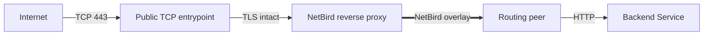
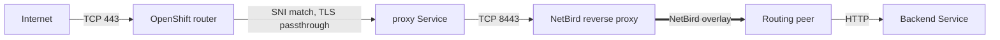

import {Note, Warning} from "@/components/mdx"

export const description =
    'Run the NetBird reverse proxy on Red Hat OpenShift with the rootless UBI image, automatic Let\'s Encrypt certificates, and either a TCP LoadBalancer or TLS-passthrough Routes for public exposure.'

# Reverse Proxy on OpenShift

This guide deploys the NetBird reverse proxy on OpenShift so an external client can reach a backend Service over the NetBird overlay. The proxy obtains and renews its own TLS certificates with ACME, runs under the stock `restricted-v2` security context constraint, and needs no custom SCC, privileged mode, host networking, or elevated capabilities.

It uses the rootless proxy image built on Red Hat Universal Base Image (UBI) 9. The image runs as a non-root user and keeps its writable directories group-writable so OpenShift can assign an arbitrary UID.

<Note>
    **Availability:** The rootless UBI proxy image is published starting with NetBird **v0.80.0** as `ghcr.io/netbirdio/reverse-proxy:0.80.0-rootless-ubi`. Use it for every new OpenShift deployment from that release forward. It is also available on Docker Hub as `netbirdio/reverse-proxy`. Pin a version or digest for reproducible deployments; see [NetBird releases](https://github.com/netbirdio/netbird/releases).
</Note>

## How it works

The proxy is an ordinary NetBird reverse proxy instance: it registers with your management server over gRPC, receives the service mappings for its cluster domain, terminates TLS, and forwards traffic through the NetBird overlay to a routing peer that reaches the backend Service.



Public exposure of the reverse proxy and access to the backend through NetBird are separate requirements. Only the proxy is reachable from the Internet. The backend Service stays `ClusterIP` and is reached through the routing peer only.

The public TCP entrypoint can be either of the following. Both forward TCP 443 to the proxy without terminating TLS, so the proxy answers the Let's Encrypt challenge and presents the issued certificate itself:

- **A `LoadBalancer` Service**, when your cluster has a LoadBalancer provider. This is the preferred option. See [Preferred exposure: a TCP LoadBalancer](#preferred-exposure-a-tcp-load-balancer).
- **The OpenShift ingress router with TLS-passthrough Routes**, when it does not. See [Fallback without a LoadBalancer: TLS-passthrough Routes](#fallback-without-a-load-balancer-tls-passthrough-routes).

<Note>
    The [Traefik requirement](/manage/reverse-proxy#traefik-requirement) for self-hosted deployments applies to the reverse proxy in front of the **management server**, not to the proxy deployed here. On OpenShift, the router's passthrough termination or a TCP load balancer keeps TLS intact between the client and the NetBird proxy, which is what the feature needs.
</Note>

## Prerequisites

Before you start, make sure you have:

- An OpenShift login with permission to create Deployments, Services, Secrets, PersistentVolumeClaims and, for the Route fallback, Routes in the target namespace. No additional SCC is needed.
- A Linux amd64 node to schedule the proxy on, and a default StorageClass that can provision a 1 GiB PVC.
- A **proxy access token** from your NetBird management server. This is not a client setup key or a personal access token:
  - **NetBird Cloud** - create an account-scoped token in the dashboard under **Reverse Proxy** > **Clusters** > **Setup Self-Hosted Cluster**, or through the API. See [Bring Your Own Proxy](/manage/reverse-proxy/bring-your-own-proxy). The management address is `https://api.netbird.io`.
  - **Self-hosted** - create a management-wide token with `netbird-server admin token create` (combined container) or `netbird-mgmt admin token create` (multi-container). See [Enable Reverse Proxy](/selfhosted/migration/enable-reverse-proxy). Because this proxy runs outside the management host's Docker network, the management server's Traefik must also route the `ProxyService` gRPC path and have its idle timeout disabled. Follow [Prepare the management server for cross-host proxies](/selfhosted/maintenance/scaling/multiple-proxy-instances#prepare-the-management-server-for-cross-host-proxies) first.
- Public DNS names you control, and inbound TCP 443 connectivity from the Internet to the proxy.
- Outbound access from the cluster to your NetBird management server, the configured signal and relay services, and Let's Encrypt.
- A NetBird routing peer that can reach the backend Service. The examples below use the rootless UBI client from the [OpenShift installation guide](/get-started/install/openshift) deployed in the same cluster.

The examples use two hostnames. Replace them with your own:

| Variable | Example | Purpose |
|----------|---------|---------|
| `NB_PROXY_DOMAIN` | `proxy.example.com` | The proxy **cluster address**. This is the value of the `NB_PROXY_DOMAIN` environment variable and the base domain services are created under. |
| `NB_SERVICE_DOMAIN` | `nginx.proxy.example.com` | The **service hostname** users visit. Here it is a subdomain of the cluster domain; a verified [custom domain](/manage/reverse-proxy/custom-domains) works the same way. |

Run the commands in this guide in Bash:

```bash
NB_PROXY_DOMAIN=proxy.example.com
NB_SERVICE_DOMAIN=nginx.proxy.example.com
NAMESPACE=netbird-proxy

oc create namespace "$NAMESPACE" --dry-run=client -o yaml | oc apply -f -
```

## Step 1: Create the configuration Secret

The Deployment reads `NB_PROXY_TOKEN` and `NB_PROXY_DOMAIN` from the `proxy-token` and `proxy-domain` keys of a Secret named `netbird-proxy-config`. Create it without writing the token into a manifest or your shell history:

```bash
read -r -s -p 'Proxy access token: ' NB_PROXY_TOKEN
printf '\n'
oc create secret generic netbird-proxy-config -n "$NAMESPACE" \
  --from-literal=proxy-domain="$NB_PROXY_DOMAIN" \
  --from-literal=proxy-token="$NB_PROXY_TOKEN"
unset NB_PROXY_TOKEN
```

Changes to this Secret are picked up only after a rollout restart of the proxy Deployment.

## Step 2: Deploy the proxy

Self-issued ACME certificates and their account keys live on a single writable volume. The Deployment therefore runs one replica with the `Recreate` strategy, uses filesystem locking for the certificate cache, and mounts a PersistentVolumeClaim at `/certs` so the ACME account and issued certificates survive pod replacement.

Save the following as `netbird-proxy.yaml`. Set `NB_PROXY_MANAGEMENT_ADDRESS` to the management server that issued your token.

```yaml
apiVersion: v1
kind: PersistentVolumeClaim
metadata:
  name: netbird-proxy-certs
  namespace: netbird-proxy
spec:
  accessModes:
    - ReadWriteOnce
  resources:
    requests:
      storage: 1Gi
---
apiVersion: apps/v1
kind: Deployment
metadata:
  name: netbird-proxy
  namespace: netbird-proxy
  labels:
    app.kubernetes.io/name: netbird-proxy
spec:
  replicas: 1
  strategy:
    type: Recreate
  selector:
    matchLabels:
      app.kubernetes.io/name: netbird-proxy
  template:
    metadata:
      labels:
        app.kubernetes.io/name: netbird-proxy
    spec:
      automountServiceAccountToken: false
      nodeSelector:
        kubernetes.io/os: linux
        kubernetes.io/arch: amd64
      securityContext:
        runAsNonRoot: true
        seccompProfile:
          type: RuntimeDefault
      containers:
        - name: proxy
          image: ghcr.io/netbirdio/reverse-proxy:0.80.0-rootless-ubi
          imagePullPolicy: IfNotPresent
          env:
            - name: NB_PROXY_TOKEN
              valueFrom:
                secretKeyRef:
                  name: netbird-proxy-config
                  key: proxy-token
            - name: NB_PROXY_DOMAIN
              valueFrom:
                secretKeyRef:
                  name: netbird-proxy-config
                  key: proxy-domain
            - name: NB_PROXY_MANAGEMENT_ADDRESS
              value: https://netbird.example.com:443
            - name: NB_PROXY_ADDRESS
              value: :8443
            - name: NB_PROXY_HEALTH_ADDRESS
              value: :8080
            - name: NB_PROXY_ACME_CERTIFICATES
              value: "true"
            - name: NB_PROXY_ACME_CHALLENGE_TYPE
              value: tls-alpn-01
            - name: NB_PROXY_CERTIFICATE_DIRECTORY
              value: /certs
            - name: NB_PROXY_CERT_LOCK_METHOD
              value: flock
            - name: NB_PROXY_SUPPORTS_CUSTOM_PORTS
              value: "false"
          ports:
            - name: https
              containerPort: 8443
            - name: health
              containerPort: 8080
          securityContext:
            allowPrivilegeEscalation: false
            capabilities:
              drop:
                - ALL
          startupProbe:
            httpGet:
              path: /healthz/startup
              port: health
            periodSeconds: 5
            timeoutSeconds: 3
            failureThreshold: 60
          readinessProbe:
            httpGet:
              path: /healthz/ready
              port: health
            periodSeconds: 10
            timeoutSeconds: 3
          livenessProbe:
            httpGet:
              path: /healthz/live
              port: health
            periodSeconds: 10
            timeoutSeconds: 3
          resources:
            requests:
              cpu: 100m
              memory: 256Mi
          volumeMounts:
            - name: certificates
              mountPath: /certs
      volumes:
        - name: certificates
          persistentVolumeClaim:
            claimName: netbird-proxy-certs
---
apiVersion: v1
kind: Service
metadata:
  name: netbird-proxy
  namespace: netbird-proxy
  labels:
    app.kubernetes.io/name: netbird-proxy
spec:
  type: ClusterIP
  selector:
    app.kubernetes.io/name: netbird-proxy
  ports:
    - name: https
      port: 443
      targetPort: https
```

Apply it and wait for the rollout:

```bash
oc apply -f netbird-proxy.yaml
oc rollout status deployment/netbird-proxy -n "$NAMESPACE" --timeout=5m
```

The Service is `ClusterIP` on purpose. [Step 3](#step-3-expose-the-proxy) either switches it to `LoadBalancer` or leaves it internal and puts Routes in front of it.

<Note>
    On OpenShift, leave `runAsUser`, `runAsGroup`, and `fsGroup` unset. The `restricted-v2` admission applies the namespace's allowed identity and volume group for you, and the image is built to work under that arbitrary UID.
</Note>

### Configuration explained

| Setting | Why |
|---------|-----|
| `replicas: 1` and `strategy: Recreate` | One process owns the certificate cache on the PVC. A rolling update would briefly run two writers against the same volume. Do not scale this configuration as-is to multiple replicas. |
| `NB_PROXY_CERT_LOCK_METHOD=flock` | Filesystem locking on the PVC. The `auto` default may select the Kubernetes lease backend, which needs a service account with lease RBAC. This Deployment mounts no service account token. |
| `NB_PROXY_ADDRESS=:8443` | The proxy listens on an unprivileged port. The Service maps port 443 to it. |
| `NB_PROXY_HEALTH_ADDRESS=:8080` | Binds the health endpoint to all interfaces so kubelet can reach the startup, readiness, and liveness probes. The same endpoint serves [Prometheus metrics](/selfhosted/observability/proxy). |
| `NB_PROXY_ACME_CERTIFICATES=true` and `NB_PROXY_ACME_CHALLENGE_TYPE=tls-alpn-01` | The proxy issues and renews certificates itself over port 443. Port 80 is not required. See [TLS-ALPN-01 requirements](/manage/reverse-proxy#tls-alpn-01-requirements). |
| `NB_PROXY_CERTIFICATE_DIRECTORY=/certs` on a PVC | Retains the ACME account key and certificates across pod replacement. Keep the PVC; deleting it forces fresh issuance and counts against Let's Encrypt rate limits. |
| `NB_PROXY_SUPPORTS_CUSTOM_PORTS=false` | Neither the Service nor the Routes expose arbitrary TCP or UDP ports, so the cluster does not advertise the **Custom Ports** capability. |
| `automountServiceAccountToken: false` and `capabilities: drop: [ALL]` | The proxy needs no Kubernetes API access and no Linux capabilities. |

For the full list of variables, see the [environment variable reference](/selfhosted/migration/enable-reverse-proxy#environment-variable-reference).

<Note>
    **Using cert-manager instead of ACME.** If cert-manager already issues certificates in your cluster, you can mount its TLS Secret at `/certs` as a read-only volume, set `NB_PROXY_ACME_CERTIFICATES=false`, and drop the PVC and lock settings. The certificate must cover the cluster domain and `*.{cluster domain}` for the static mode to serve every service hostname. Choose one certificate-management mode for the Deployment rather than combining both. See [TLS certificate configuration](/manage/reverse-proxy#tls-certificate-configuration).
</Note>

## Step 3: Expose the proxy

Pick one of the two options below. In both cases, public TCP 443 must reach the proxy's port 8443 **without TLS termination in between**, for the initial certificate issuance as well as every renewal.

### Preferred exposure: a TCP LoadBalancer

If your cluster has a LoadBalancer provider, change the Service type. No Route is needed in this mode:

```bash
oc patch service netbird-proxy -n "$NAMESPACE" -p '{"spec":{"type":"LoadBalancer"}}'
oc get service netbird-proxy -n "$NAMESPACE"
```

A working provider allocates an externally reachable address and forwards **TCP 443 to the proxy's port 8443 without terminating TLS**. A cloud network load balancer or MetalLB with public routing both qualify. MetalLB alone does not make a private address reachable from the Internet.

Point the proxy hostname at the provisioned address with an `A`/`AAAA` record for an IP, or a `CNAME` for a load balancer hostname. Then point the service hostnames at the proxy hostname with a wildcard `CNAME`:

| Record type | Name | Value |
|-------------|------|-------|
| `A` or `CNAME` | `proxy.example.com` | The load balancer's IP or hostname |
| `CNAME` | `*.proxy.example.com` | `proxy.example.com` |

Use a proxy hostname whose DNS you can actually update. Publish an `AAAA` record only if the IPv6 path also works end to end.

With this TCP entrypoint, no per-domain OpenShift Routes are needed. The NetBird proxy routes by the hostname in the TLS handshake and handles every configured service hostname itself.

### Fallback without a LoadBalancer: TLS-passthrough Routes

If the cluster has no LoadBalancer provider, use the existing public OpenShift ingress router instead. Leave the `netbird-proxy` Service as `ClusterIP`.

The OpenShift router picks a backend by matching the Route's hostname against the SNI in the TLS handshake, not by Service name. **Every service hostname NetBird knows about therefore needs its own Route with TLS passthrough, pointing at the proxy Service.** It is one Route per hostname, not one Kubernetes Service per hostname.

Create the Route for the example service hostname:

```bash
oc create route passthrough nginx-proxy -n "$NAMESPACE" \
  --hostname="$NB_SERVICE_DOMAIN" \
  --service=netbird-proxy \
  --port=https
```

The equivalent manifest:

```yaml
apiVersion: route.openshift.io/v1
kind: Route
metadata:
  name: nginx-proxy
  namespace: netbird-proxy
spec:
  host: nginx.proxy.example.com
  to:
    kind: Service
    name: netbird-proxy
  port:
    targetPort: https
  tls:
    termination: passthrough
```

For each additional service hostname, such as `app.proxy.example.com`, create another Route with a unique name and `--hostname`, keeping `--service=netbird-proxy --port=https`. A Route for the bare cluster domain or for a parent domain does not match `nginx.proxy.example.com`. If a Route for the hostname already exists, update it rather than creating a duplicate.

Then configure DNS. The proxy hostname points at the public OpenShift ingress endpoint, and the service hostnames point at the proxy hostname:

| Record type | Name | Value |
|-------------|------|-------|
| `CNAME` | `proxy.example.com` | The router's public endpoint, for example `router-default.apps.<cluster>.example.com` |
| `CNAME` | `*.proxy.example.com` | `proxy.example.com` |

DNS gets the connection to the router. The Route's hostname match gets it from the router to the NetBird proxy. A `CNAME` does not change the hostname sent in the TLS handshake, so the Route must match the service hostname exactly.



<Warning>
    Passthrough leaves TLS intact so the NetBird proxy, not the OpenShift router, answers Let's Encrypt's challenge and presents the issued certificate. Do not use `edge` or `reencrypt` termination with the `tls-alpn-01` challenge. If the router terminates TLS, clients receive the cluster's wildcard certificate and issuance never completes.
</Warning>

## Step 4: Connect a backend

The backend proves end-to-end connectivity. It should be reachable only through the proxy and the NetBird overlay, never directly from the Internet.

### Deploy a test backend

Deploy an unprivileged nginx listening on port 8080, fronted by a `ClusterIP` Service named `nginx-server` that maps HTTP port 80 to the container's port 8080. Keep this Service internal. The public entrypoint targets the NetBird proxy, not nginx.

```yaml
apiVersion: apps/v1
kind: Deployment
metadata:
  name: nginx-server
  namespace: netbird-proxy
spec:
  replicas: 1
  selector:
    matchLabels:
      app: nginx-server
  template:
    metadata:
      labels:
        app: nginx-server
    spec:
      automountServiceAccountToken: false
      securityContext:
        runAsNonRoot: true
        seccompProfile:
          type: RuntimeDefault
      containers:
        - name: nginx
          image: docker.io/nginxinc/nginx-unprivileged:stable-alpine
          ports:
            - name: http
              containerPort: 8080
          securityContext:
            allowPrivilegeEscalation: false
            readOnlyRootFilesystem: true
            capabilities:
              drop: [ALL]
          readinessProbe:
            httpGet:
              path: /
              port: http
          resources:
            requests:
              cpu: 10m
              memory: 16Mi
            limits:
              memory: 64Mi
          volumeMounts:
            - name: tmp
              mountPath: /tmp
      volumes:
        - name: tmp
          emptyDir: {}
---
apiVersion: v1
kind: Service
metadata:
  name: nginx-server
  namespace: netbird-proxy
spec:
  type: ClusterIP
  selector:
    app: nginx-server
  ports:
    - name: http
      port: 80
      targetPort: http
```

### Add the backend to NetBird

The proxy reaches the backend through a routing peer, so the backend has to exist as a network resource first:

1. **Deploy a routing peer** in the cluster. Follow [OpenShift Installation](/get-started/install/openshift) to run the rootless UBI client, preferably with a [persistent peer identity](/get-started/install/openshift#persistent-peer-identity) so the routing peer assignment survives restarts.
2. **Create a network and a domain resource** with the address `nginx-server.netbird-proxy.svc.cluster.local`, and assign the UBI client as its routing peer. That peer must be able to resolve and reach the Service, which any pod in the cluster can. See [Networks](/manage/networks).
3. **Add an access policy** that lets the proxy's embedded peer reach the resource. The proxy joins your NetBird network as a peer when it receives its first service mapping. See [Access Control](/manage/access-control/manage-network-access).
4. **Create the reverse proxy service.** Go to **Reverse Proxy** > **Services** > **Add Service**, enter the subdomain `nginx`, and pick your cluster domain `proxy.example.com` as the base domain. Choose **HTTP** mode, select the **Domain** resource as the target with protocol **HTTP** and port **80**, and configure [authentication](/manage/reverse-proxy/authentication) as needed. See the [Reverse Proxy quick start](/manage/reverse-proxy#quick-start).

The routing peer and the access policy only get traffic to nginx. NetBird still has to know which public hostname maps to that service before the proxy requests a certificate for it: the proxy asks Let's Encrypt for a certificate when it receives the service mapping from management. Creating a DNS record or a Route alone does not register a service.

<Note>
    `tls-alpn-01` issues certificates for individual hostnames, not wildcards. Public TCP 443 must reach the proxy for both initial issuance and renewal. Port 80 is not required for this challenge type. See [RFC 8737, section 3](https://datatracker.ietf.org/doc/html/rfc8737#section-3).
</Note>

## Step 5: Verify the deployment and certificate

Check that the PVC is bound, the rollout finished, and the proxy connected to management:

```bash
oc get pvc netbird-proxy-certs -n "$NAMESPACE"
oc rollout status deployment/netbird-proxy -n "$NAMESPACE" --timeout=5m
oc logs -f deployment/netbird-proxy -n "$NAMESPACE"
```

Confirm the pod was admitted under `restricted-v2` with an OpenShift-assigned UID:

```bash
oc get pods -n "$NAMESPACE" -l app.kubernetes.io/name=netbird-proxy \
  -o 'custom-columns=NAME:.metadata.name,SCC:.metadata.annotations.openshift\.io/scc,UID:.spec.containers[0].securityContext.runAsUser'
```

For the Route fallback, also check that the router admitted the Route:

```bash
oc get route nginx-proxy -n "$NAMESPACE" \
  -o jsonpath='{range .status.ingress[*].conditions[*]}{.type}={.status}: {.message}{"\n"}{end}'
```

In the dashboard, the cluster appears under **Reverse Proxy** > **Clusters** with an **Online** badge once the proxy registers, and the service under **Reverse Proxy** > **Services** moves from `certificate_pending` to `active` once the certificate is issued.

From outside the cluster, check DNS and HTTPS without disabling certificate verification:

```bash
dig "$NB_SERVICE_DOMAIN"
curl --head --show-error --connect-timeout 10 "https://$NB_SERVICE_DOMAIN/"
```

A successful rollout alone does not prove certificate issuance or backend connectivity. HTTPS must present a trusted certificate for the service hostname. An authentication redirect or denial is expected if you enabled authentication on the service; after authenticating, the nginx welcome page confirms the backend is reachable over the overlay.

## Troubleshooting

| Symptom | What to check |
|---------|---------------|
| `EXTERNAL-IP` stays `<pending>` on the LoadBalancer Service | The cluster has no working LoadBalancer provider. Use the [Route fallback](#fallback-without-a-load-balancer-tls-passthrough-routes) instead. |
| The cluster's wildcard certificate is returned for the service hostname | Traffic reaches the router but not the proxy. Check the exact Route `host`, its admission status, the target Service and port, and that termination is `passthrough`. |
| ACME reports `no viable challenge type found` | This follows failed validation, not only an unsupported challenge type. Check the public `A`/`AAAA`/`CNAME` records and end-to-end TCP 443 passthrough to the proxy. |
| Service stays in `certificate_pending` | Same as above. Also confirm the service hostname is under the cluster domain or a verified [custom domain](/manage/reverse-proxy/custom-domains) attached to this cluster, and that any [CAA records](/manage/reverse-proxy/custom-domains#check-your-caa-records) allow `letsencrypt.org`. |
| Cannot write certificates or acquire a lock | Check that the PVC is bound and mounted read-write at `/certs`, and that no `runAsUser` or `fsGroup` override is set on the pod. |
| Pod fails with a permissions error under `/certs` or `/var/lib/netbird` | Confirm the pod runs under `restricted-v2` with no fixed `runAsUser`, and that the StorageClass supports pod volume permissions. Do not add privileged init containers or relax the SCC to work around it. |
| Management gRPC logs HTML `404`/`502` responses or repeated `PROTOCOL_ERROR` | The management server's reverse proxy is not routing the `ProxyService` gRPC path, or is cutting long-lived HTTP/2 streams. See [Prepare the management server for cross-host proxies](/selfhosted/maintenance/scaling/multiple-proxy-instances#prepare-the-management-server-for-cross-host-proxies). This is separate from public ACME routing. |
| Proxy logs `Unauthenticated` right after start | Wrong or revoked `NB_PROXY_TOKEN`, or a token from a different management server than `NB_PROXY_MANAGEMENT_ADDRESS`. Recreate the Secret and restart the Deployment. |
| HTTPS works but nginx is unreachable, or the service stays in `tunnel_not_created` | Check the routing peer is connected, the access policy covers the proxy's embedded peer, the resource address resolves from the routing peer, and the target uses HTTP on port 80. See [Reverse Proxy Troubleshooting](/manage/reverse-proxy/troubleshooting). |

Do not repeatedly delete the certificate PVC or restart the proxy to retry issuance before fixing DNS or public routing. Each attempt counts against Let's Encrypt rate limits.

## Related pages

- [OpenShift Installation](/get-started/install/openshift) - run the rootless UBI NetBird client on OpenShift, including as a routing peer
- [Bring Your Own Proxy](/manage/reverse-proxy/bring-your-own-proxy) - account-scoped proxy tokens and clusters on NetBird Cloud
- [Enable Reverse Proxy](/selfhosted/migration/enable-reverse-proxy) - management-wide proxy tokens and the full environment variable reference
- [Running Multiple Proxy Instances](/selfhosted/maintenance/scaling/multiple-proxy-instances) - management server preparation for remote proxies and HA patterns
- [Custom Domains](/manage/reverse-proxy/custom-domains) - use your own domain for service hostnames
- [Reverse Proxy Troubleshooting](/manage/reverse-proxy/troubleshooting) - diagnose backend connectivity problems
