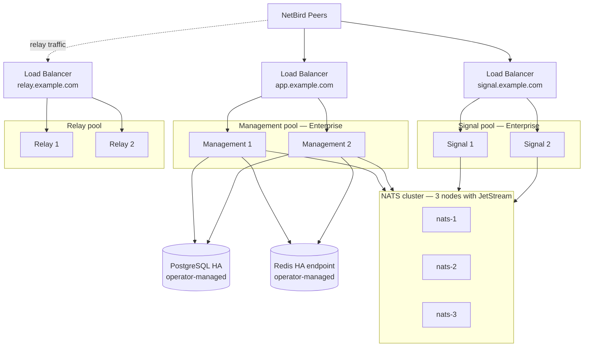

# Running a Highly Available Self-Hosted Deployment

import {Note, Warning} from "@/components/mdx";

This guide explains how to run NetBird self-hosted enterprise in **active-active high-availability mode**. Three independent service pools — Management, Signal, and Relay — each run with multiple instances behind their own load balancer, sharing state through external PostgreSQL, Redis, and a clustered NATS deployment. Single-node failures stop affecting peer connectivity, and you can perform rolling upgrades without taking the service offline.

This guide is for **existing NetBird Enterprise self-hosted deployments** already running on PostgreSQL. It walks you through the full transition to active-active high availability — every component, from start to finish. PostgreSQL and Redis are documented at the level NetBird cares about: what we require from the endpoint you provide, with pointers to the upstream documentation for the underlying HA setup. Everything NetBird-specific — NATS, Relay, Signal, Management replicas, and the load balancers — is covered in full here, so you can complete the deployment without leaving this page.

<Note>
    HA for Management and Signal requires enterprise commercial license.Pricing and license details are on the
    [on-prem pricing page](https://netbird.io/pricing#on-prem).
</Note>

## Architecture

A highly available NetBird deployment splits the single-server design into **three independent service pools**, each replicated across multiple instances and each sitting behind its own load balancer. The three components have very different connection profiles — short-lived stateless API calls, long-lived peer-signaling sessions, and persistent WebSocket relay streams — so separating them lets each pool scale and fail over on its own terms instead of forcing every instance to handle every kind of traffic.

- **Management pool** — enterprise Management replicas serving the dashboard API, Management gRPC, and OAuth2 endpoints. Fully stateless: any replica can serve any request because all durable state lives in PostgreSQL and all short-lived state lives in Redis. Replicas scale horizontally to absorb dashboard traffic, peer sync, and OAuth flows.
- **Signal pool** — enterprise Signal replicas serving the Signal gRPC API. Peers connect to one Signal instance through the load balancer; cross-instance peer signaling is reconciled through the NATS cluster, so any Signal instance can deliver a message to any peer regardless of which instance that peer happens to be connected to. This is what makes Signal active-active in the enterprise build — see [How active-active Signal works](#how-active-active-signal-works) below.
- **Relay pool** — Relay instances serving WebSocket relay traffic for peers that can't reach each other directly. Each relay session pins to one Relay instance for its lifetime via the load balancer's natural connection affinity; failover happens by reconnecting through the LB to a healthy instance. Relay traffic flows peer-to-relay, bypassing the Management and Signal pools entirely.

Three tiers of shared infrastructure underpin these pools:

- **NATS cluster** — the only piece of HA infrastructure NetBird owns directly. Routes cross-instance Signal messages, distributes dynamic configuration (log level, rate limits), and carries the traffic-flow event stream. Quorum is mandatory; loss of quorum stalls cross-instance signaling.
- **PostgreSQL HA endpoint** — durable state for the Management pool (accounts, peers, policies, OAuth state, integrations). Operator-managed; NetBird treats it as an opaque connection string and assumes failover happens transparently below the DSN.
- **Redis HA endpoint** — ephemeral cache (OAuth PKCE verifiers, peer cache, dynamic config). Operator-managed; losing Redis costs in-flight OAuth flows but does not break running peer connections.

Each pool is exposed to peers through a single stable URL — backed by its own load-balanced backend instances — so peers see exactly three endpoints (Management, Signal, Relay) regardless of how many instances live behind each one. Adding or removing instances within a pool is transparent to peers because the URL never changes.



The three load balancers can be three independent load balancers, three frontends on one shared load balancer, or three managed-LB resources — whatever fits your infrastructure. The key property is that each pool is reached through one stable URL with at least two backend instances and a load balancer that can fail over within seconds.

### How active-active Signal works

In single-node mode, the Signal service keeps peer connection state in memory and cannot be replicated. In the enterprise HA build, every Signal instance connects to the NATS cluster and uses it to route signaling messages between peers connected to different instances. When peer A (connected to Signal 1 via the LB) needs to reach peer B (connected to Signal 2), Signal 1 publishes the signaling message to NATS, and Signal 2's NATS subscription forwards it to peer B. The Signal load balancer can distribute peers across instances freely because NATS reconciles cross-instance routing — a healthy NATS cluster is mandatory.

## What you'll need before starting

- An active **NetBird Enterprise commercial license**.
- At least **2 enterprise Management instances**, on separate failure domains.
- At least **2 enterprise Signal instances**, on separate failure domains.
- At least **2 Relay instances**, on separate failure domains.
- At least **3 NATS instances** for the coordination cluster, on separate failure domains. NATS can colocate with NetBird hosts, but the 3 NATS instances must be on different failure domains.
- A **load balancer** for each pool — Management, Signal, and Relay. These can be three independent LBs, three frontends on one shared LB, or three managed-LB resources, as long as each pool is reachable through a single stable URL. Any L7 LB that supports HTTP/2 + gRPC works (HAProxy, Nginx, AWS ALB, GCP LB, Azure LB, F5, Envoy, etc.).
- Three public **FQDNs** — one per pool (e.g. `app.example.com`, `signal.example.com`, `relay.example.com`) — each resolving to its corresponding load balancer.
- Root/sudo on each host, or equivalent privileges in your container orchestrator.

## Step 1 — Make PostgreSQL highly available

NetBird treats PostgreSQL as an opaque connection string. You give it a DSN; NetBird makes no assumptions about replication, failover, or topology behind that DSN. PostgreSQL HA is your responsibility.

### What NetBird requires

- **A single, stable connection endpoint** that survives node failure. NetBird does not implement read replicas, partitioning, or client-side connection pooling against a list of hosts.
- **Read-write access** on every store DSN. NetBird writes on every store; a read-only replica is not sufficient.
- All three NetBird stores (`server.store`, `server.activityStore`, `server.authStore`) configured with PostgreSQL DSNs. They can point at the same database/instance or at separate ones, depending on your isolation requirements.
- **TLS** is recommended (`sslmode=require` in the DSN).

### Common HA patterns

| Pattern | Notes |
|---|---|
| **Managed PostgreSQL** (AWS RDS Multi-AZ, GCP Cloud SQL HA, Azure Database for PostgreSQL, Aiven, Neon) | Easiest. The service exposes a single endpoint and handles failover internally. |
| **Streaming replication + Patroni or Stolon**, fronted by PgBouncer or HAProxy | Self-hosted. Patroni handles primary election; PgBouncer/HAProxy exposes a single virtual endpoint that follows the elected primary. |
| **PostgreSQL with `pg_auto_failover`** | Lighter-weight alternative to Patroni. |

For the full PostgreSQL high-availability documentation, see [PostgreSQL: High Availability, Load Balancing, and Replication](https://www.postgresql.org/docs/current/high-availability.html).

### If your current PostgreSQL is not HA

If your current deployment runs a single-instance PostgreSQL, you'll need to migrate to an HA setup. The migration path depends entirely on where you're moving to (managed service, Patroni cluster, your platform team's standard) — NetBird does not prescribe the migration mechanism. Whichever approach you choose, the constraints below apply.

<Warning>
    The `NETBIRD_ENCRYPTION_KEY` must remain **byte-identical** before and after the PostgreSQL migration. Sensitive
    fields in the database are encrypted with this key; rotating it during a migration will corrupt all encrypted
    fields with no path to recovery. Preserve the value from your current deployment and apply it to every replica
    in the HA setup.
</Warning>

At a minimum, your migration must:

1. Take a logically consistent backup of the current PostgreSQL data (e.g. `pg_dump`, snapshot, point-in-time copy — your choice).
2. Restore the data into the new HA PostgreSQL setup, preserving schemas and table ownership.
3. Update `server.store.dsn`, `server.activityStore.dsn`, and `server.authStore.dsn` in `config.yaml` to point at the new HA endpoint.
4. Keep `NETBIRD_ENCRYPTION_KEY` identical to the value used by the original deployment.

Validate after migration by starting one replica against the new endpoint and confirming it boots cleanly, the dashboard loads, and existing peers reconnect.

### How Management points at PostgreSQL

Every Management replica's `config.yaml` references the PostgreSQL HA endpoint through three store DSNs. All three can use the same database (or separate databases if you prefer isolation between management, activity, and auth stores):

```yaml
server:
  store:
    engine: "postgres"
    dsn: "host=pg.example.com user=netbird password=*** dbname=netbird port=5432 sslmode=require"
    encryptionKey: "<preserved from existing deployment — identical on every replica>"

  activityStore:
    engine: "postgres"
    dsn: "host=pg.example.com user=netbird password=*** dbname=netbird port=5432 sslmode=require"

  authStore:
    engine: "postgres"
    dsn: "host=pg.example.com user=netbird password=*** dbname=netbird port=5432 sslmode=require"
```

The full `config.yaml` is assembled in [Step 7](#step-7-configure-and-deploy-the-management-pool).

## Step 2 — Set up a Redis HA endpoint

NetBird uses Redis as a shared cache across the Management pool. There is no persistent state in Redis — losing the entire Redis instance is recoverable: in-flight OAuth flows fail until Redis is back, but established peer connections continue working because they don't touch Redis on every message.

### What NetBird requires

NetBird connects to Redis as a **single standalone instance** — one URL, one endpoint, the standard Redis protocol. The URL you supply must point at a stable address that handles failover internally; NetBird does not negotiate failover from its side.

- **URL schemes:** `redis://` or `rediss://` (TLS). TLS is strongly recommended for any network-traversing traffic.
- **One URL only.** NetBird does not accept a list of hosts and does not perform client-side failover. Whatever sits behind the URL is responsible for failover.
- **No cluster-aware or Sentinel-aware behavior.** NetBird does not negotiate the [Redis Cluster](https://redis.io/docs/management/scaling/) protocol (MOVED redirects, slot-aware routing) or the [Redis Sentinel](https://redis.io/docs/management/sentinel/) discovery protocol. The endpoint must look like a standard standalone Redis instance from NetBird's side.

### What works for HA

| Approach | Works? | Notes |
|---|---|---|
| **Managed Redis with a single primary endpoint** — AWS ElastiCache for Redis (cluster mode **disabled** / replication group with replicas), GCP Memorystore for Redis (Standard tier), Azure Cache for Redis (Standard or Premium tier without clustering), Upstash Redis (regional), Redis Enterprise Cloud (active-passive) | **Yes** | Easiest path. The service exposes a single DNS name; failover is handled internally and the DNS name follows the new primary automatically. |
| **Self-hosted Redis Sentinel + TCP proxy** (HAProxy with a Sentinel-aware backend selector, Nginx `stream` module, or a keepalived-managed VIP that follows the Sentinel-elected master) | **Yes** | Sentinel handles master election; the TCP proxy exposes one stable address that always forwards to the current master. NetBird connects to the proxy and never speaks Sentinel. |
| **Redis Cluster (cluster mode enabled, multi-shard)** even with a single-VIP front door | **No** | NetBird's keys hash to different cluster slots; only keys served by the shard behind the VIP are reachable. Other reads and writes fail with `MOVED` errors that NetBird cannot follow because it doesn't speak the Cluster protocol. |
| **Multiple Redis URLs** (round-robin DNS, comma-separated list, etc.) | **No** | NetBird takes a single URL string. Failover must be transparent below the URL, not negotiated client-side. |

### Recommended path

- **If you run on a major cloud:** use managed Redis in **non-cluster / standalone-with-replication** mode. Look for "cluster mode disabled", "replication group", or "standard tier with failover" in your provider's UI. This is the path with the least operational burden — the provider hides failover behind a single DNS name.
- **If you self-host:** Redis Sentinel + TCP proxy is the right pattern. See the [Redis Sentinel documentation](https://redis.io/docs/management/sentinel/) for Sentinel setup. For the proxy layer, HAProxy with a Sentinel-aware health check (or keepalived for an IP-level VIP) is the typical choice.

<Warning>
    If you accidentally point NetBird at a **cluster-mode Redis** (e.g. ElastiCache cluster mode enabled with
    multiple shards), the deployment may appear to work at first because some keys happen to land on the
    accessible shard — then fail intermittently as other keys hash to inaccessible shards. Confirm your managed
    Redis is in non-cluster mode before pointing NetBird at it.
</Warning>

### What gets stored

| Data | TTL / pattern |
|---|---|
| OAuth PKCE verifiers, one-time proxy tokens | 10 minutes |
| Peer cache (public-key → account/peer ID) | 30 minutes + jitter |
| Dynamic log-level and rate-limit configuration | Polled every 5 minutes, pub/sub for instant updates |

If Redis becomes unreachable, only in-flight OAuth flows fail; established peer connections continue working until cache entries expire.

### How Management points at Redis

Every Management replica's `config.yaml` references the Redis HA endpoint through `server.ha.redisAddr`:

```yaml
server:
  ha:
    enabled: true
    redisAddr: "redis://redis.example.com:6379"
    # natsEndpoints set in Step 3 below
```

The full `config.yaml` is assembled in [Step 7](#step-7-configure-and-deploy-the-management-pool).

## Step 3 — Set up the NATS cluster

NATS is the only piece of HA infrastructure NetBird owns directly — this section walks through it end-to-end.

A three-node NATS cluster with JetStream provides quorum-based replication for the traffic-flow stream and durable storage for dynamic configuration. Two of three nodes must be healthy for writes to succeed.

### Deploy three NATS nodes

Run one container per host. Each node needs a unique name, persistent storage, and routes to its peers. Substitute hostnames per node.

```yaml
# /etc/netbird/nats/docker-compose.yml on each host
services:
  nats:
    image: nats:2
    container_name: netbird-nats
    restart: unless-stopped
    command:
      - "--name=nats-1"
      - "--cluster_name=netbird"
      - "--cluster=nats://0.0.0.0:6222"
      - "--routes=nats://nats-1.example.com:6222,nats://nats-2.example.com:6222,nats://nats-3.example.com:6222"
      - "--jetstream"
      - "--store_dir=/data"
      - "-m=8222"
    ports:
      - "4222:4222"   # client connections
      - "6222:6222"   # cluster routes (NATS ↔ NATS)
      - "8222:8222"   # monitoring
    volumes:
      - nats_data:/data

volumes:
  nats_data:
```

Repeat for `nats-2` and `nats-3`, updating `--name` and the host's own DNS entry. The `--routes` list is the same on every node.

| NATS port | Purpose | Exposure |
|---|---|---|
| `4222/tcp` | Client connections from NetBird and Signal instances | Reachable from the Management and Signal pools |
| `6222/tcp` | Cluster routes (NATS ↔ NATS) | Reachable between NATS nodes only |
| `8222/tcp` | Monitoring / `/healthz` | Internal observability |

<Warning>
    Three NATS containers on the same Docker host share a single point of failure. Place each NATS node on a
    separate physical host, VM, or availability zone.
</Warning>

### Replicate the traffic-flow stream

Once the cluster is up, ensure the `traffic-events` JetStream stream is created with three replicas so each message persists on every NATS node. Run this once from any host with the `nats` CLI installed:

```bash
nats --server nats://nats-1.example.com:4222 \
  stream add traffic-events \
  --subjects "traffic-events.>" \
  --storage file \
  --replicas 3 \
  --retention limits \
  --max-age 168h \
  --discard old \
  --defaults
```

If the stream already exists with `replicas=1` (the single-node default), edit it instead:

```bash
nats stream edit traffic-events --replicas 3
```

### Verify the cluster

```bash
nats --server nats://nats-1.example.com:4222 server report jetstream
```

You should see three nodes, one elected as JetStream meta-leader, and the `traffic-events` stream showing three replicas with all peers healthy.

### How Management points at NATS

Every Management replica's `config.yaml` references the NATS cluster through `server.ha.natsEndpoints` — a **comma-separated list of all cluster endpoints**. Each Management and Signal instance connects to one of them and handles failover and reconnection across the rest internally:

```yaml
server:
  ha:
    enabled: true
    natsEndpoints: "nats://nats-1.example.com:4222,nats://nats-2.example.com:4222,nats://nats-3.example.com:4222"
    # redisAddr from Step 2 also goes here
```

Signal instances reference the same list via the `NATS_ENDPOINTS` environment variable (see [Step 6](#step-6-deploy-the-signal-pool)). The full Management `config.yaml` is assembled in [Step 7](#step-7-configure-and-deploy-the-management-pool).

**Why an explicit list and not a single DNS round-robin URL?** A single hostname with multiple A/AAAA records (e.g. `nats://nats.example.com:4222`) works because the underlying client resolves and reconnects, but recovery time depends on DNS TTL and cache. An explicit comma-separated list of node addresses gives immediate visibility of every node and the fastest possible failover when one becomes unreachable. **Prefer the explicit list.**

## Step 4 — Configure the three load balancers

NetBird does not prescribe a specific load balancer — any L7 LB that supports HTTP/2 and gRPC will work (HAProxy, Nginx, AWS ALB, GCP Load Balancer, Azure Application Gateway, F5, Envoy, etc.). Use whatever your platform team already operates.

You need **three load balancers** (or three frontends on one shared LB) — one per pool — each fronting its own backend instances and reachable through its own DNS name. Set them up now with empty backend pools; you'll register backends as you deploy each pool in Steps 5–7.

| Pool | Public FQDN | Backend port | Frontend protocol | Health check |
|---|---|---|---|---|
| Relay | e.g. `relay.example.com` | 443 | HTTPS with WebSocket upgrade | TCP/443 |
| Signal | e.g. `signal.example.com` | 443 | HTTPS, HTTP/2, gRPC | TCP/443 (or gRPC health if supported) |
| Management | e.g. `app.example.com` | 443 | HTTPS, HTTP/2, gRPC | `GET /api/health` → HTTP 200 |

Common requirements for every pool:

| Requirement | Notes |
|---|---|
| **TLS at the LB or pass-through to the backend** | If you terminate TLS at the LB, set `server.tls` to empty on the Management replicas; if you pass through, configure TLS on each backend. |
| **HTTP/2 + gRPC support end-to-end** | Required for Management and Signal pools. The Relay pool uses WebSockets over HTTPS — make sure your LB supports WebSocket upgrade and long-lived connections. |
| **Connection-level affinity** | Default for any L4 LB and any L7 LB doing HTTP/2 streaming — a single long-lived connection stays on one backend for its lifetime. **No application-level sticky sessions required.** Cross-instance state is reconciled by NATS (Signal) or held in PostgreSQL/Redis (Management). |
| **Active health checks** | Mark backends out of the pool on failure within seconds, not minutes. |
| **Connection draining on rolling upgrade** | When you remove a backend, the LB should let in-flight gRPC streams and WebSocket connections finish before tearing them down. |
| **Generous idle timeout** | Management gRPC streams and Relay WebSocket connections can be long-lived; set the idle timeout above your peer-sync interval (10–30 minutes is comfortable for both). |

For the full set of paths and protocols NetBird exposes to each load balancer, see [Configuration Files Reference](/selfhosted/maintenance/configuration-files).

If you're using a managed cloud load balancer, configure the equivalent of each row above using your provider's UI/IaC. If you're using a self-hosted reverse proxy, the same configuration model applies — define one backend pool per service, attach health checks, and enable HTTP/2 + WebSocket as appropriate per pool.

## Step 5 — Deploy the Relay pool

Deploy at least two Relay instances on separate failure domains. The instances are identical — all configured with the same `NB_AUTH_SECRET` and the same `NB_EXPOSED_ADDRESS` (the Relay LB URL). The Relay LB distributes new WebSocket connections across instances; each connection is pinned to one instance for its lifetime by the LB's natural connection affinity.

The Relay pool uses the **upstream Relay image** (`netbirdio/relay`) — there is no enterprise-specific Relay image. Relay does not validate a license; it authenticates incoming WebSocket connections against the shared `NB_AUTH_SECRET`.

Run this on each Relay host (e.g. `relay-host-1`, `relay-host-2` — internal hostnames, since peers reach them only via the LB URL):

```yaml
# /etc/netbird/relay/docker-compose.yml on each Relay host
services:
  relay:
    image: netbirdio/relay:latest
    container_name: netbird-relay
    restart: unless-stopped
    ports:
      - "443:443"          # WebSocket relay traffic (registered with the Relay LB)
      - "3478:3478/udp"    # STUN (direct, not load-balanced — see below)
    environment:
      - NB_LOG_LEVEL=info
      - NB_LISTEN_ADDRESS=:443
      - NB_EXPOSED_ADDRESS=rels://relay.example.com:443
      - NB_AUTH_SECRET=<shared secret, identical on every Relay instance and on the Management pool>
      - NB_ENABLE_STUN=true
      - NB_STUN_PORTS=3478
```

| Env var | Required | Notes |
|---|---|---|
| `NB_EXPOSED_ADDRESS` | Yes | The Relay LB URL. **Identical on every instance** — this is what peers see, not the per-instance hostname. |
| `NB_AUTH_SECRET` | Yes | Shared with `server.authSecret` and `server.relays.secret` on the Management pool. Must be byte-identical on every Relay instance and on every Management replica. |
| `NB_LISTEN_ADDRESS` | Yes | The address the relay binds inside the container. |
| `NB_LOG_LEVEL` | No | `debug`, `info` (default), `warn`, `error`. |
| `NB_ENABLE_STUN` | No | Enables the embedded STUN server on UDP. |
| `NB_STUN_PORTS` | No | STUN port (default `3478`). |

Start the relay on each host:

```bash
docker compose -f /etc/netbird/relay/docker-compose.yml up -d
docker compose logs -f relay  # verify startup
```

### Register the Relay instances in the Relay LB

Add each Relay host's IP (or backend reference, depending on your LB) to the Relay LB's backend pool on port `443`. Once all instances are registered and healthy, verify:

```bash
curl -I https://relay.example.com/
```

You should get a `200 OK` (or `426 Upgrade Required` if the relay rejects non-WebSocket probes — that's also a healthy response).

### STUN handling

STUN is served by the **relay instances themselves** — each relay container with `NB_ENABLE_STUN=true` (which the compose snippet above sets) runs an embedded STUN server on UDP/3478 alongside the WebSocket relay listener. You do **not** need a separate STUN/TURN service.

What you do need is to tell peers where to find STUN, via `server.stuns` in the Management config. Because UDP/3478 cannot pass through an HTTP/TCP load balancer, peers reach each relay's STUN endpoint **directly** rather than through the relay LB — which means one STUN URL per relay instance, each with its own DNS A record:

- Add an A record per relay host: `stun-1.example.com → relay-host-1`, `stun-2.example.com → relay-host-2`, etc.
- List each in `server.stuns` (see the config fragment below). Peers iterate the list during NAT discovery.

### How Management points at the Relay LB and STUN

Every Management replica's `config.yaml` references the Relay pool through a **single LB URL** in `server.relays.addresses` — the LB does the fan-out across Relay instances, so this list always has exactly one entry. STUN is configured separately under `server.stuns`:

```yaml
server:
  authSecret: "<NB_AUTH_SECRET — identical on every Relay instance>"

  # External STUN — per-instance hostnames (option 1) or external STUN/TURN (option 2)
  stuns:
    - uri: "stun:stun-1.example.com:3478"
      proto: "udp"
    - uri: "stun:stun-2.example.com:3478"
      proto: "udp"

  # External Relay pool — one URL pointing at the Relay LB
  relays:
    addresses:
      - "rels://relay.example.com:443"
    secret: "<NB_AUTH_SECRET — same as server.authSecret>"
    credentialsTTL: "24h"
```

The full Management `config.yaml` is assembled in [Step 7](#step-7-configure-and-deploy-the-management-pool).

## Step 6 — Deploy the Signal pool

Deploy at least two Signal instances on separate failure domains. Each instance connects to the NATS cluster (Step 3) and uses it to reconcile cross-instance peer signaling. The Signal LB can distribute peers across instances freely — NATS reconciles the routing.

The Signal pool requires the **enterprise Signal image**, which includes the NATS coordination paths needed for active-active replication. The upstream community Signal image (`netbirdio/signal`) runs in single-node mode only and cannot be used in HA. Use the enterprise Signal image URL provided alongside your license; the compose example below shows the current published path.

Run this on each Signal host:

```yaml
# /etc/netbird/signal/docker-compose.yml on each Signal host
services:
  signal:
    image: ghcr.io/netbirdio/signal-cloud:latest
    container_name: netbird-signal
    restart: unless-stopped
    ports:
      - "443:443"   # Signal gRPC (registered with the Signal LB)
    environment:
      - NB_LICENSE_KEY=<your enterprise license key>
      - NATS_ENDPOINTS=nats://nats-1.example.com:4222,nats://nats-2.example.com:4222,nats://nats-3.example.com:4222
      - SINGLE_NODE_MODE=false
    command:
      - --log-level
      - info
      - --log-file
      - console
      - --port
      - "443"
```

| Env var | Required | Notes |
|---|---|---|
| `NB_LICENSE_KEY` | Yes | Enterprise license key. Same value on every Signal instance. |
| `NATS_ENDPOINTS` | Yes | Comma-separated list of NATS cluster endpoints from Step 3. Identical on every Signal instance. |
| `SINGLE_NODE_MODE` | Yes | Must be `false`. When unset or set to `true`, Signal runs in single-node mode without NATS coordination — incompatible with HA. |

You need TLS for Signal gRPC. Either terminate TLS at the Signal LB and have the LB forward plain HTTP/2 (h2c) to backends on port 443, or pass TLS through to the backends — in the pass-through case, mount certificates into each Signal container and adjust `--port`/listen address accordingly.

Start Signal on each host:

```bash
docker compose -f /etc/netbird/signal/docker-compose.yml up -d
docker compose logs -f signal
```

In the logs, look for a NATS connection success message on startup. If you see `NATS_ENDPOINTS environment variable not set` or a NATS connection error, fix that before continuing — Signal will not work in HA without NATS.

### Register the Signal instances in the Signal LB

Add each Signal host to the Signal LB's backend pool on port `443`. Once all instances are registered and healthy, verify the LB:

```bash
# Quick TCP probe via the LB hostname
nc -zv signal.example.com 443
```

Cross-instance routing will be verified end-to-end after the Management pool is up and peers connect (Step 8).

### How Management points at the Signal LB

Every Management replica's `config.yaml` references the Signal pool through a **single LB URL** in `server.signalUri` — the LB does the fan-out across Signal instances, so this is always one entry:

```yaml
server:
  signalUri: "https://signal.example.com:443"
```

The full Management `config.yaml` is assembled in [Step 7](#step-7-configure-and-deploy-the-management-pool).

## Step 7 — Configure and deploy the Management pool

Now configure the Management replicas to point at everything you've set up: Postgres, Redis, NATS, the Relay LB URL, and the Signal LB URL. Distribute the same `config.yaml` to every enterprise Management replica.

Note that `server.relays.addresses` and `server.signalUri` each take **one URL** — the load balancer URL for that pool. The LB distributes traffic across the instances behind it, so NetBird does not need to know about the individual Relay or Signal instance addresses.

```yaml
server:
  exposedAddress: "https://app.example.com:443"
  authSecret: "<NB_AUTH_SECRET — same value as on every Relay instance>"
  dataDir: "/var/lib/netbird/"

  # External STUN — see Step 5 for the per-instance vs. external STUN trade-off
  stuns:
    - uri: "stun:stun-1.example.com:3478"
      proto: "udp"
    - uri: "stun:stun-2.example.com:3478"
      proto: "udp"

  # External Relay pool — one URL pointing at the Relay LB
  relays:
    addresses:
      - "rels://relay.example.com:443"
    secret: "<NB_AUTH_SECRET — same value as on every Relay instance>"
    credentialsTTL: "24h"

  # External Signal pool — one URL pointing at the Signal LB
  signalUri: "https://signal.example.com:443"

  # HA — enables active-active mode in the Management pool
  ha:
    enabled: true
    natsEndpoints: "nats://nats-1.example.com:4222,nats://nats-2.example.com:4222,nats://nats-3.example.com:4222"
    redisAddr: "redis://redis.example.com:6379"

  # PostgreSQL stores — all three must be Postgres in HA
  store:
    engine: "postgres"
    dsn: "host=pg.example.com user=netbird password=*** dbname=netbird port=5432 sslmode=require"
    encryptionKey: "<preserved from existing deployment — identical on every replica>"

  activityStore:
    engine: "postgres"
    dsn: "host=pg.example.com user=netbird password=*** dbname=netbird port=5432 sslmode=require"

  authStore:
    engine: "postgres"
    dsn: "host=pg.example.com user=netbird password=*** dbname=netbird port=5432 sslmode=require"

  trafficFlow:
    enabled: true
    address: "https://app.example.com:443"
    interval: "60s"
```

When `server.ha.enabled: true`, the enterprise Management server derives the runtime environment automatically:

| Environment variable | Source | Purpose |
|---|---|---|
| `NB_SINGLE_INSTANCE_MODE` | hard-coded `false` | Enables shared-state code paths |
| `NB_CACHE_REDIS_ADDRESS` | `server.ha.redisAddr` | Redis cache URL |
| `NATS_ENDPOINTS` | `server.ha.natsEndpoints` | NATS endpoints |
| `NB_NATS_ENDPOINTS` | `server.ha.natsEndpoints` | NATS endpoints for traffic-flow services |

You do **not** need to set these envs manually — they are populated from `config.yaml`.

<Warning>
    Distribute the **exact same `config.yaml`** to every Management replica, including the same `encryptionKey`.
    Sensitive fields in PostgreSQL are encrypted with this key; if replicas disagree they cannot read each other's
    records, and the cluster will appear to corrupt data on every failover. Use a secret manager (Vault, AWS Secrets
    Manager, SOPS, sealed-secrets) to keep the value synchronised.
</Warning>

### Deploy the Management replicas

Bring up replicas one at a time and register each in the Management LB once healthy.

1. **Verify dependencies are reachable from a Management host**:
   ```bash
   psql 'host=pg.example.com sslmode=require user=netbird dbname=netbird' -c '\dt'
   redis-cli -u "redis://redis.example.com:6379" ping        # expect: PONG
   nats --server nats://nats-1.example.com:4222 server check connection  # expect: OK
   ```
2. **Distribute `config.yaml`** to every Management replica host. Verify identical files (`sha256sum config.yaml`) on each.
3. **Start replica 1**. Wait for `/api/health` to return 200 and check the logs for `Starting CloudServer` followed by `Management server started`.
4. **Register replica 1** in the Management LB. Confirm the dashboard is reachable via `https://app.example.com/`.
5. **Start replica 2**, verify health, register in the LB.
6. **Repeat for any additional replicas.**

## Step 8 — Verify HA end-to-end

Run each failure scenario and confirm the expected behavior. Do this in a staging environment first.

| Scenario | Expected behavior |
|---|---|
| Stop one Management replica | The Management LB marks it unhealthy within seconds; API traffic continues on remaining replicas. Established peer connections (signal, relay) are unaffected because they flow through the Signal and Relay LBs, not the Management LB. |
| Stop one Signal instance | The Signal LB marks it unhealthy; peers connected to that instance reconnect via the LB and land on a surviving Signal instance. Cross-peer signaling continues via NATS without interruption to peers that were already connected to a different instance. |
| Stop one Relay instance | The Relay LB marks it unhealthy; new peer relay sessions go to surviving instances. Existing WebSocket sessions on the killed instance drop and peers re-establish via the LB. |
| Stop one NATS node | Cluster retains quorum (2 of 3 healthy). Writes to the `traffic-events` stream continue. Cross-instance Signal routing continues. |
| Disconnect Redis | New OAuth flows fail until Redis returns; established peer connections continue working. Dynamic log/rate-limit changes pause. |
| Trigger PostgreSQL failover (managed service) | Brief outage during the failover; Management replicas reconnect to the new primary and resume. Existing peer connections survive the gap because they don't touch PostgreSQL on every message. |

If any scenario doesn't match the expected behavior, see [Troubleshooting](#troubleshooting) below.

## Operations

### Rolling upgrades

The procedure is the same for any of the three pools: drain one instance, upgrade it, return it to the LB, repeat. Schema migrations on the Management pool run automatically on first startup of any replica; subsequent replicas detect the migrated schema and start without re-running it.

1. Mark instance #1 as draining in its load balancer. Wait for active gRPC streams or WebSocket connections to drain (or hit your drain timeout).
2. Stop and re-pull the image on instance #1: `docker compose pull && docker compose up -d`.
3. Wait for the instance's health check to pass.
4. Add instance #1 back to the LB pool.
5. Repeat for the remaining instances in the pool.

Upgrade Relay, Signal, and Management pools in any order — the protocols between pools are stable across patch releases.

### Adding or removing instances

To **add** an instance to a pool: provision the host, install the same image with the same configuration as existing instances, start the service, add it to the LB pool once healthy. No coordination required — the new instance reads the same shared state.

To **remove** an instance: mark it as draining in the LB, wait for streams to drain, stop the service. The remaining instances continue serving traffic.

### Rotating secrets

| Secret | How to rotate |
|---|---|
| `POSTGRES_PASSWORD` / Postgres user password | Update the password in PostgreSQL, update the DSN in every Management replica's `config.yaml`, restart Management replicas one at a time. |
| Redis password | Update Redis, update `server.ha.redisAddr` on every Management replica, restart Management replicas one at a time. |
| `NB_AUTH_SECRET` (relay auth) | Update on every Relay instance simultaneously, then update `server.authSecret` and `server.relays.secret` on every Management replica simultaneously. Plan for a brief window where peer relay sessions reject during the mismatch — restart Management and Relay together to minimise it. |
| `NETBIRD_ENCRYPTION_KEY` | **Do not rotate.** This key encrypts data at rest in PostgreSQL; rotating it has no migration path and corrupts every encrypted field. Plan a fresh deployment if you ever need to change it. |

## Troubleshooting

### Management replicas fail to decrypt records: `cipher: message authentication failed`

`NETBIRD_ENCRYPTION_KEY` differs between Management replicas. Confirm the value is byte-identical on every replica (no trailing newline, no quotes added by your secret manager). Restart every replica after fixing.

### OAuth flow fails with "invalid PKCE verifier" after failover

The Redis URL changed mid-flow, or Redis was unreachable. Verify the URL resolves to a single stable endpoint from every replica:

```bash
redis-cli -u "$NB_CACHE_REDIS_ADDRESS" ping
```

Expected: `PONG`.

### Signal logs `NATS_ENDPOINTS environment variable not set`

`SINGLE_NODE_MODE` is unset (or set to `true`) on the Signal instance, or `NATS_ENDPOINTS` is empty. In HA, every Signal instance must have `SINGLE_NODE_MODE=false` and a non-empty `NATS_ENDPOINTS` pointing at the NATS cluster.

### Signal messages don't reach peers connected to a different Signal instance

NATS cluster connectivity is broken or `NATS_ENDPOINTS` is misconfigured on one of the Signal instances. Check the Signal logs on the instance receiving the original peer message — successful cross-instance routing logs the publish to NATS. If the publish fails, verify the Signal instance can reach every NATS node on port 4222.

### Traffic-flow events stop appearing in the dashboard

The NATS cluster lost quorum. Verify two of three nodes are healthy:

```bash
nats --server nats://nats-1.example.com:4222 server check jetstream
```

If a node is down, restart it and wait for it to rejoin the cluster. The `traffic-events` stream resumes writes as soon as quorum returns.

### Relay rejects peer connections with `auth: invalid token`

`NB_AUTH_SECRET` differs between the Relay instances and the Management pool's `server.authSecret` / `server.relays.secret`. The three values must all be byte-identical. Confirm on every Relay container and in every Management replica's `config.yaml`.

### Management replica refuses to start: `Redis is required for multi-instance mode`

`server.ha.enabled: true` but `server.ha.redisAddr` is empty or unreachable. Set the address and confirm connectivity from the replica:

```bash
redis-cli -u "<server.ha.redisAddr>" ping
```

### Load balancer health checks all fail simultaneously

All replicas are likely failing to start for the same reason — usually PostgreSQL unreachable or an encryption key mismatch. Check the logs on any one replica:

```bash
docker compose logs netbird-server | tail -100
```

Look for `failed to connect to postgres`, `decode encryption key: illegal base64 data`, or `cipher: message authentication failed`.
