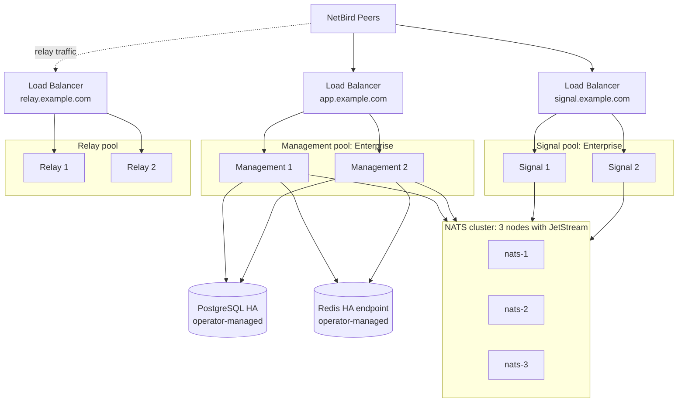

# Running a Highly Available Self-Hosted Deployment

import {Note, Warning} from "@/components/mdx";

A single NetBird server works well for many deployments, but production environments may need to remain available when an individual host or service instance fails. A highly available deployment removes those single points of failure by spreading services across separate failure domains and routing traffic to healthy instances.

NetBird Enterprise supports **active-active high availability (HA)** for Management and Signal. This guide shows how to move an existing self-hosted deployment to that mode: Management, Signal, and Relay run as independent, load-balanced pools, while PostgreSQL, Redis, and NATS provide the shared state that lets a healthy instance continue serving traffic when another instance fails.

Use this guide when you need to tolerate the loss of a Management, Signal, Relay, or NATS node and perform rolling upgrades with minimal disruption. It assumes an existing Enterprise deployment that already uses PostgreSQL. For a distributed deployment without active-active Management and Signal, see [Splitting Your Self-Hosted Deployment](/selfhosted/maintenance/scaling/scaling-your-self-hosted-deployment).

<Note>
    Active-active HA for Management and Signal requires a NetBird Enterprise commercial license. Pricing and license details are on the
    [on-prem pricing page](https://netbird.io/pricing#on-prem).
</Note>

## Before you begin

This is an infrastructure migration, not an in-place switch. Build and validate the new dependencies before changing the public endpoints used by your existing deployment.

| Confirm | Why it matters |
|---|---|
| You have a recent, restorable PostgreSQL backup. | Database migration or endpoint changes should always have a rollback path. |
| You have recorded the current `server.store.encryptionKey` value. | Every Management replica must use the exact same key to read existing encrypted data. |
| You can deploy instances in separate failure domains. | Two containers on one host do not provide high availability. |
| You have stable DNS names and load balancers for Management, Signal, and Relay. | Peers and the dashboard must keep using stable URLs while backends change. |
| PostgreSQL and Redis can each expose one highly available, read-write endpoint. | Management replicas need a shared database and cache, not per-instance stores. |
| You can test the change in staging first. | Failure testing is part of validating an HA deployment. |

### Deployment order

Build the HA deployment in this sequence:

1. Make PostgreSQL and Redis highly available.
2. Deploy and validate the three-node NATS cluster.
3. Create the Management, Signal, and Relay load-balancer frontends and DNS records.
4. Deploy the Relay and Signal pools.
5. Configure and deploy the Management pool.
6. Validate normal operation and then run the failure tests.

### Scope and endpoint choices

This guide uses three public service URLs:

| Service | Example URL | Used by |
|---|---|---|
| Management | `https://app.example.com` | Dashboard, Management API, Management gRPC, and OAuth |
| Signal | `https://signal.example.com` | NetBird peers for signaling |
| Relay | `rels://relay.example.com:443` | NetBird peers that need relay connectivity |

The Management URL can remain the URL used by your existing deployment. If you change it, update the dashboard environment to use the new Management API and gRPC endpoints; see [Dashboard environment configuration](/selfhosted/maintenance/configuration-files#dashboardenv). The dashboard itself is stateless and can be served behind the Management load balancer or separately, as long as browsers can reach the configured Management URL.

## Architecture

A highly available deployment has three service pools. They have different connection patterns, so they scale and fail over independently instead of forcing every host to handle every workload.

- **Management pool:** Enterprise Management replicas serve the dashboard API, Management gRPC, and OAuth2 endpoints. Fully stateless: any replica can serve any request because all durable state lives in PostgreSQL and all short-lived state lives in Redis. Replicas scale horizontally to absorb dashboard traffic, peer sync, and OAuth flows.
- **Signal pool:** Enterprise Signal replicas serve the Signal gRPC API. Peers connect to one Signal instance through the load balancer. The NATS cluster reconciles cross-instance peer signaling, so any Signal instance can deliver a message to any peer regardless of its connected instance. This makes Signal active-active in the Enterprise build. See [How active-active Signal works](#how-active-active-signal-works).
- **Relay pool:** Relay instances serve WebSocket relay traffic for peers that cannot reach each other directly. Each relay session stays on one Relay instance for its lifetime through the load balancer's natural connection affinity. When an instance fails, peers reconnect through the load balancer to a healthy instance. Relay traffic flows directly between peers and the Relay pool.

The pools depend on the following shared infrastructure:

- **NATS cluster:** Routes cross-instance Signal messages, distributes dynamic configuration (log level and rate limits), and carries the traffic-flow event stream. Quorum is mandatory. Loss of quorum stalls cross-instance signaling.
- **PostgreSQL HA endpoint:** Stores durable Management data, including accounts, peers, policies, OAuth state, and integrations. It is operator-managed. NetBird treats it as an opaque connection string and expects failover to happen transparently behind the DSN.
- **Redis HA endpoint:** Stores ephemeral cache data, including OAuth PKCE verifiers, peer cache data, and dynamic configuration. It is operator-managed. Losing Redis interrupts in-flight OAuth flows but does not break running peer connections.

Each pool uses one stable URL backed by its load-balanced instances. Adding or removing instances is transparent to peers because the URL does not change.



The three load balancers can be independent load balancers, frontends on one shared load balancer, or managed load-balancer resources. Choose the model that fits your infrastructure. Each pool must be reached through one stable URL with at least two backend instances and a load balancer that can fail over within seconds.

### How active-active Signal works

In single-node mode, the Signal service keeps peer connection state in memory and cannot be replicated. In the Enterprise HA build, every Signal instance connects to the NATS cluster and uses it to route signaling messages between peers connected to different instances. When peer A, connected to Signal 1 through the load balancer, needs to reach peer B, connected to Signal 2, Signal 1 publishes the signaling message to NATS. Signal 2's NATS subscription forwards it to peer B. The Signal load balancer can distribute peers across instances freely because NATS reconciles cross-instance routing. A healthy NATS cluster is mandatory.

## Prerequisites

- An active **NetBird Enterprise commercial license**.
- At least **2 enterprise Management instances**, on separate failure domains.
- At least **2 enterprise Signal instances**, on separate failure domains.
- At least **2 Relay instances**, on separate failure domains.
- At least **3 NATS instances** for the coordination cluster, on separate failure domains. NATS can colocate with NetBird hosts, but the 3 NATS instances must be on different failure domains.
- A **load balancer** for each pool: Management, Signal, and Relay. These can be three independent load balancers, three frontends on one shared load balancer, or three managed load-balancer resources, as long as each pool is reachable through a single stable URL. Management and Signal require HTTP/2 + gRPC support. Relay requires WebSocket support.
- Three public **FQDNs**, one per pool. For example: `app.example.com`, `signal.example.com`, and `relay.example.com`. Each must resolve to its corresponding load balancer.
- Permissions to deploy services, mount configuration and secrets, expose network ports, and register instances with the load balancers in your environment.

## Step 1: Make PostgreSQL highly available

NetBird treats PostgreSQL as an opaque connection string. You give it a DSN; NetBird makes no assumptions about replication, failover, or topology behind that DSN. PostgreSQL HA is your responsibility.

### What NetBird requires

- **A single, stable connection endpoint** that survives node failure. NetBird does not implement read replicas, partitioning, or client-side connection pooling against a list of hosts.
- **Read-write access** on every store DSN. NetBird writes on every store; a read-only replica is not sufficient.
- All three NetBird stores (`server.store`, `server.activityStore`, `server.authStore`) configured with PostgreSQL DSNs. They can point at the same database/instance or at separate ones, depending on your isolation requirements.
- **TLS** is recommended (`sslmode=require` in the DSN).

### Common HA patterns

| Pattern | Notes |
|---|---|
| **Managed PostgreSQL** (AWS RDS Multi-AZ, GCP Cloud SQL HA, Azure Database for PostgreSQL, Aiven, Neon) | Easiest. The service exposes a single endpoint and handles failover internally. |
| **Streaming replication + Patroni or Stolon**, fronted by PgBouncer or HAProxy | Self-hosted. Patroni handles primary election; PgBouncer/HAProxy exposes a single virtual endpoint that follows the elected primary. |
| **PostgreSQL with `pg_auto_failover`** | Lighter-weight alternative to Patroni. |

For the full PostgreSQL high-availability documentation, see [PostgreSQL: High Availability, Load Balancing, and Replication](https://www.postgresql.org/docs/current/high-availability.html).

### If your current PostgreSQL is not HA

If your current PostgreSQL deployment is not highly available, move it behind an HA endpoint before adding multiple Management replicas. Use the database platform your organization already trusts, such as a managed PostgreSQL service, a Patroni or Stolon cluster, `pg_auto_failover`, or another standard HA pattern. NetBird only depends on the endpoint behavior, so the implementation can follow your existing database operations model. Whichever approach you choose, the constraints below apply.

<Warning>
    The encryption key configured as `server.store.encryptionKey` must remain **byte-identical** before and after
    the PostgreSQL migration. Sensitive fields in the database are encrypted with this key; rotating it during a
    migration makes existing encrypted data unreadable. Preserve the value from your current deployment and apply
    it to every Management replica in the HA setup.
</Warning>

At a minimum, your migration must:

1. Take a logically consistent backup of the current PostgreSQL data. For example, use `pg_dump`, a snapshot, or a point-in-time copy.
2. Restore the data into the new HA PostgreSQL setup, preserving schemas and table ownership.
3. Update `server.store.dsn`, `server.activityStore.dsn`, and `server.authStore.dsn` in `config.yaml` to point at the new HA endpoint.
4. Keep `server.store.encryptionKey` identical to the value used by the original deployment.

Validate after migration by starting one replica against the new endpoint and confirming it boots cleanly, the dashboard loads, and existing peers reconnect.

### How Management points at PostgreSQL

Every Management replica's `config.yaml` references the PostgreSQL HA endpoint through three store DSNs. All three can use the same database (or separate databases if you prefer isolation between management, activity, and auth stores):

```yaml
server:
  store:
    engine: "postgres"
    dsn: "host=pg.example.com user=netbird password=*** dbname=netbird port=5432 sslmode=require"
    encryptionKey: "<preserved from existing deployment; identical on every replica>"

  activityStore:
    engine: "postgres"
    dsn: "host=pg.example.com user=netbird password=*** dbname=netbird port=5432 sslmode=require"

  authStore:
    engine: "postgres"
    dsn: "host=pg.example.com user=netbird password=*** dbname=netbird port=5432 sslmode=require"
```

The full `config.yaml` is assembled in [Step 7](#step-7-configure-and-deploy-the-management-pool).

## Step 2: Set up a Redis HA endpoint

NetBird uses Redis as a shared cache across the Management pool. Redis does not hold persistent NetBird state. If Redis becomes unavailable, in-flight OAuth flows fail until it returns. Established peer connections continue working because they do not query Redis for every message.

### What NetBird requires

NetBird connects to Redis as a **single standalone instance** using one URL and the standard Redis protocol. The URL must point to a stable endpoint that handles failover internally. NetBird does not negotiate failover itself.

- **URL schemes:** `redis://` or `rediss://` (TLS). TLS is strongly recommended for any network-traversing traffic.
- **One URL only.** NetBird does not accept a list of hosts and does not perform client-side failover. Whatever sits behind the URL is responsible for failover.
- **No cluster-aware or Sentinel-aware behavior.** NetBird does not negotiate the [Redis Cluster](https://redis.io/docs/management/scaling/) protocol (MOVED redirects, slot-aware routing) or the [Redis Sentinel](https://redis.io/docs/management/sentinel/) discovery protocol. The endpoint must look like a standard standalone Redis instance from NetBird's side.

### What works for HA

| Approach | Works? | Notes |
|---|---|---|
| **Managed Redis with a single primary endpoint**: AWS ElastiCache for Redis (cluster mode **disabled** / replication group with replicas), GCP Memorystore for Redis (Standard tier), Azure Cache for Redis (Standard or Premium tier without clustering), Upstash Redis (regional), Redis Enterprise Cloud (active-passive) | **Yes** | Easiest path. The service exposes one DNS name and handles failover internally. The DNS name follows the new primary automatically. |
| **Self-hosted Redis Sentinel + TCP proxy** (HAProxy with a Sentinel-aware backend selector, Nginx `stream` module, or a keepalived-managed VIP that follows the Sentinel-elected master) | **Yes** | Sentinel elects the primary. The TCP proxy exposes one stable address that forwards to the current primary. NetBird connects to the proxy and does not communicate with Sentinel. |
| **Redis Cluster (cluster mode enabled, multi-shard)** even with a single-VIP front door | **No** | NetBird keys can hash to different cluster slots. Only keys served by the shard behind the VIP are reachable. Other reads and writes fail with `MOVED` errors that NetBird cannot follow. |
| **Multiple Redis URLs** (round-robin DNS, comma-separated list, etc.) | **No** | NetBird takes a single URL string. Failover must be transparent below the URL, not negotiated client-side. |

### Recommended path

- **If you run on a major cloud:** Use managed Redis in **non-cluster / standalone-with-replication** mode. Look for "cluster mode disabled", "replication group", or "standard tier with failover" in your provider's UI. This option has the least operational burden because the provider hides failover behind a single DNS name.
- **If you self-host:** Redis Sentinel + TCP proxy is the right pattern. See the [Redis Sentinel documentation](https://redis.io/docs/management/sentinel/) for Sentinel setup. For the proxy layer, HAProxy with a Sentinel-aware health check (or keepalived for an IP-level VIP) is the typical choice.

<Warning>
    If you accidentally point NetBird at a **cluster-mode Redis** (e.g. ElastiCache cluster mode enabled with
    multiple shards), the deployment may appear to work at first because some keys happen to land on the
    accessible shard. It can then fail intermittently as other keys hash to inaccessible shards. Confirm your managed
    Redis is in non-cluster mode before pointing NetBird at it.
</Warning>

### What gets stored

| Data | TTL / pattern |
|---|---|
| OAuth PKCE verifiers, one-time proxy tokens | 10 minutes |
| Peer cache (public-key → account/peer ID) | 30 minutes + jitter |
| Dynamic log-level and rate-limit configuration | Polled every 5 minutes, pub/sub for instant updates |

If Redis becomes unreachable, in-flight OAuth flows fail. Established peer connections continue working until cache entries expire.

### How Management points at Redis

Every Management replica's `config.yaml` references the Redis HA endpoint through `server.ha.redisAddr`:

```yaml
server:
  ha:
    enabled: true
    redisAddr: "redis://redis.example.com:6379"
    # natsEndpoints set in Step 3 below
```

The full `config.yaml` is assembled in [Step 7](#step-7-configure-and-deploy-the-management-pool).

## Step 3: Set up a NATS HA cluster

NetBird uses NATS for coordination between Management and Signal instances. Like PostgreSQL and Redis, the NATS deployment is operator-owned: you can use a managed NATS service, a Kubernetes operator, or a self-hosted cluster, as long as it exposes the behavior NetBird requires.

### What NetBird requires

- A **highly available NATS cluster** with at least three nodes across separate failure domains.
- **JetStream enabled** with persistent storage.
- **Quorum available** for writes. In a three-node cluster, at least two nodes must be healthy.
- Client endpoints reachable from every Management and Signal instance.
- TLS and authentication appropriate for your network boundary.
- A replicated `traffic-events` JetStream stream for traffic-flow events.

| NATS port | Purpose | Exposure |
|---|---|---|
| `4222/tcp` | Client connections from NetBird and Signal instances | Reachable from the Management and Signal pools |
| `6222/tcp` | Cluster routes (NATS to NATS) | Reachable between NATS nodes only, if you self-host the cluster |
| `8222/tcp` | Monitoring / health endpoints | Internal observability, if enabled by your NATS deployment |

### Common HA patterns

| Pattern | Notes |
|---|---|
| **Managed NATS with JetStream** | Lowest operational burden. The provider is responsible for node placement, storage, upgrades, and failover. |
| **NATS Kubernetes operator** | Good fit when NetBird runs in Kubernetes or your platform team already operates stateful services there. Use persistent volumes and spread pods across zones or nodes. |
| **Self-hosted NATS cluster** | Works well when you already operate VMs or bare-metal services. Place each node in a separate failure domain and back JetStream with persistent storage. |

<Warning>
    Do not run all NATS nodes on the same host. The cluster may appear healthy, but that host is still a single
    point of failure.
</Warning>

### Traffic-flow stream

NetBird expects the `traffic-events` JetStream stream to be available for traffic-flow events. Configure it with:

| Setting | Value |
|---|---|
| Stream name | `traffic-events` |
| Subjects | `traffic-events.>` |
| Storage | File-backed persistent storage |
| Replicas | `3` |
| Retention | Limits-based |
| Max age | `168h` |
| Discard policy | Old messages first |

If you manage NATS directly, the equivalent `nats` CLI command is:

```bash
nats --server nats://nats-1.example.com:4222 \
  stream add traffic-events \
  --subjects "traffic-events.>" \
  --storage file \
  --replicas 3 \
  --retention limits \
  --max-age 168h \
  --discard old \
  --defaults
```

If your NATS platform manages streams declaratively, apply the same settings through that platform instead. If the stream already exists with one replica, update it to three replicas:

```bash
nats stream edit traffic-events --replicas 3
```

### Verify the cluster

Use your NATS platform's health checks to confirm the cluster is healthy and JetStream has quorum. If you use the `nats` CLI, a typical check is:

```bash
nats --server nats://nats-1.example.com:4222 server report jetstream
```

You should see three nodes, one elected as JetStream meta-leader, and the `traffic-events` stream showing three replicas with all peers healthy.

### How Management points at NATS

Every Management replica's `config.yaml` references the NATS cluster through `server.ha.natsEndpoints`, a **comma-separated list of all cluster endpoints**. Each Management and Signal instance connects to one of them and handles failover and reconnection across the rest internally:

```yaml
server:
  ha:
    enabled: true
    natsEndpoints: "nats://nats-1.example.com:4222,nats://nats-2.example.com:4222,nats://nats-3.example.com:4222"
    # redisAddr from Step 2 also goes here
```

Signal instances reference the same list via the `NATS_ENDPOINTS` environment variable (see [Step 6](#step-6-deploy-the-signal-pool)). The full Management `config.yaml` is assembled in [Step 7](#step-7-configure-and-deploy-the-management-pool).

**Why an explicit list and not a single DNS round-robin URL?** A single hostname with multiple A/AAAA records (e.g. `nats://nats.example.com:4222`) works because the underlying client resolves and reconnects, but recovery time depends on DNS TTL and cache. An explicit comma-separated list of node addresses gives immediate visibility of every node and the fastest possible failover when one becomes unreachable. **Prefer the explicit list.**

## Step 4: Configure the three load balancers

Use the load balancer your organization already operates. NetBird works with any Layer 7 load balancer that supports HTTP/2 and gRPC, including HAProxy, NGINX, AWS Application Load Balancer, Google Cloud Load Balancing, Azure Application Gateway, and Envoy.

Plan one load-balancer frontend for each service pool: Management, Signal, and Relay. These can be separate load balancers or three frontends on a shared load balancer. Each frontend needs its own DNS name and backend pool. Configure the frontends and empty backend pools now, then add instances as you deploy the Relay, Signal, and Management services in Steps 5 through 7.

| Pool | Public FQDN | Backend port | Frontend protocol | Health check |
|---|---|---|---|---|
| Relay | e.g. `relay.example.com` | 443 | HTTPS with WebSocket upgrade | TCP/443 |
| Signal | e.g. `signal.example.com` | 443 | HTTPS, HTTP/2, gRPC | TCP/443 (or gRPC health if supported) |
| Management | e.g. `app.example.com` | 443 | HTTPS, HTTP/2, gRPC | `GET /api/health` → HTTP 200 |

Common requirements for every pool:

| Requirement | Notes |
|---|---|
| **TLS termination** | **Prefer terminating TLS at the load balancer.** Set `server.tls` to empty on the Management replicas. If your environment requires TLS pass-through, configure TLS on every backend instead. |
| **HTTP/2 + gRPC support end-to-end** | Required for Management and Signal pools. The Relay pool uses WebSockets over HTTPS. Make sure your load balancer supports WebSocket upgrades and long-lived connections. |
| **Connection-level affinity** | This is the default for Layer 4 load balancers and Layer 7 load balancers that use HTTP/2 streaming. A long-lived connection stays on one backend for its lifetime. **No application-level sticky sessions are required.** NATS reconciles cross-instance Signal state, while PostgreSQL and Redis hold Management state. |
| **Active health checks** | Mark backends out of the pool on failure within seconds, not minutes. |
| **Connection draining on rolling upgrade** | When you remove a backend, the LB should let in-flight gRPC streams and WebSocket connections finish before tearing them down. |
| **Generous idle timeout** | Management gRPC streams and Relay WebSocket connections can be long-lived. Set the idle timeout above your peer-sync interval. Ten to 30 minutes is a comfortable range for both. |

For the full set of paths and protocols NetBird exposes to each load balancer, see [Configuration Files Reference](/selfhosted/maintenance/configuration-files).

If you're using a managed cloud load balancer, configure the equivalent of each row above using your provider's UI or infrastructure as code. If you're using a self-hosted reverse proxy, create one backend pool per service, attach health checks, and enable HTTP/2 or WebSocket support as appropriate for each pool.

## Step 5: Deploy the Relay pool

Deploy at least two Relay instances on separate failure domains. Configure every instance with the same `NB_AUTH_SECRET` and `NB_EXPOSED_ADDRESS`, which is the Relay load balancer URL. The Relay load balancer distributes new WebSocket connections across instances. Each connection stays on one instance for its lifetime through the load balancer's natural connection affinity.

The Relay pool uses the **upstream Relay image** (`netbirdio/relay`). There is no Enterprise-specific Relay image. Relay does not validate a license. It authenticates incoming WebSocket connections against the shared `NB_AUTH_SECRET`.

Run this on each Relay host. For example, use `relay-host-1` and `relay-host-2` as internal hostnames because peers reach the instances only through the load balancer URL:

```yaml
# /etc/netbird/relay/docker-compose.yml on each Relay host
services:
  relay:
    image: netbirdio/relay:latest
    container_name: netbird-relay
    restart: unless-stopped
    ports:
      - "443:443"          # WebSocket relay traffic (registered with the Relay LB)
      - "3478:3478/udp"    # STUN is direct and not load-balanced. See below.
    environment:
      - NB_LOG_LEVEL=info
      - NB_LISTEN_ADDRESS=:443
      - NB_EXPOSED_ADDRESS=rels://relay.example.com:443
      - NB_AUTH_SECRET=<shared secret, identical on every Relay instance and on the Management pool>
      - NB_ENABLE_STUN=true
      - NB_STUN_PORTS=3478
```

| Env var | Required | Notes |
|---|---|---|
| `NB_EXPOSED_ADDRESS` | Yes | The Relay load balancer URL. **It must be identical on every instance.** This is the URL peers see, not the per-instance hostname. |
| `NB_AUTH_SECRET` | Yes | Shared with `server.relays.secret` in every Management replica's `config.yaml`. Must be byte-identical on every Relay instance and on every Management replica. |
| `NB_LISTEN_ADDRESS` | Yes | The address the relay binds inside the container. |
| `NB_LOG_LEVEL` | No | `debug`, `info` (default), `warn`, `error`. |
| `NB_ENABLE_STUN` | No | Enables the embedded STUN server on UDP. |
| `NB_STUN_PORTS` | No | STUN port (default `3478`). |

Start the relay on each host:

```bash
docker compose -f /etc/netbird/relay/docker-compose.yml up -d
docker compose logs -f relay  # verify startup
```

### Register the Relay instances in the Relay LB

Add each Relay host's IP (or backend reference, depending on your LB) to the Relay LB's backend pool on port `443`. Once all instances are registered and healthy, verify:

```bash
curl -I https://relay.example.com/
```

You should get a `200 OK`. A `426 Upgrade Required` response is also healthy when the relay rejects non-WebSocket probes.

### STUN handling

STUN is served by the **Relay instances themselves**. Each relay container with `NB_ENABLE_STUN=true` runs an embedded STUN server on UDP/3478 alongside the WebSocket relay listener. You do **not** need a separate STUN/TURN service.

Tell peers where to find STUN through `server.stuns` in the Management configuration. UDP/3478 cannot pass through an HTTP or TCP load balancer, so peers reach each Relay instance's STUN endpoint **directly**. Configure one STUN URL and DNS A record for each Relay instance:

- Add an A record per relay host: `stun-1.example.com → relay-host-1`, `stun-2.example.com → relay-host-2`, etc.
- List each in `server.stuns` (see the config fragment below). Peers iterate the list during NAT discovery.

### How Management points at the Relay LB and STUN

Every Management replica's `config.yaml` references the Relay pool through a **single load balancer URL** in `server.relays.addresses`. The load balancer distributes traffic across Relay instances, so this list always has one entry. Configure STUN separately under `server.stuns`:

```yaml
server:
  # External STUN: per-instance hostnames (option 1) or external STUN/TURN (option 2)
  stuns:
    - uri: "stun:stun-1.example.com:3478"
      proto: "udp"
    - uri: "stun:stun-2.example.com:3478"
      proto: "udp"

  # External Relay pool: one URL pointing at the Relay load balancer
  relays:
    addresses:
      - "rels://relay.example.com:443"
    secret: "<NB_AUTH_SECRET; identical on every Relay instance>"
    credentialsTTL: "24h"
```

The full Management `config.yaml` is assembled in [Step 7](#step-7-configure-and-deploy-the-management-pool).

## Step 6: Deploy the Signal pool

Deploy at least two Signal instances on separate failure domains. Each instance connects to the NATS cluster from Step 3 and uses it to reconcile cross-instance peer signaling. The Signal load balancer can distribute peers across instances freely because NATS reconciles the routing.

The Signal pool requires the **enterprise Signal image**, which includes the NATS coordination paths needed for active-active replication. The upstream community Signal image (`netbirdio/signal`) runs in single-node mode only and cannot be used in HA. Use the enterprise Signal image URL provided alongside your license; the compose example below shows the current published path.

Run this on each Signal host:

```yaml
# /etc/netbird/signal/docker-compose.yml on each Signal host
services:
  signal:
    image: ghcr.io/netbirdio/signal-cloud:latest
    container_name: netbird-signal
    restart: unless-stopped
    ports:
      - "443:443"   # Signal gRPC (registered with the Signal LB)
    environment:
      - NB_LICENSE_KEY=<your enterprise license key>
      - NATS_ENDPOINTS=nats://nats-1.example.com:4222,nats://nats-2.example.com:4222,nats://nats-3.example.com:4222
      - SINGLE_NODE_MODE=false
    command:
      - --log-level
      - info
      - --log-file
      - console
      - --port
      - "443"
```

| Env var | Required | Notes |
|---|---|---|
| `NB_LICENSE_KEY` | Yes | Enterprise license key. Same value on every Signal instance. |
| `NATS_ENDPOINTS` | Yes | Comma-separated list of NATS cluster endpoints from Step 3. Identical on every Signal instance. |
| `SINGLE_NODE_MODE` | Yes | Must be `false`. When unset or set to `true`, Signal runs in single-node mode without NATS coordination. This mode is incompatible with HA. |

Signal gRPC requires TLS. Either terminate TLS at the Signal load balancer and forward plain HTTP/2 (h2c) to backends on port 443, or pass TLS through to the backends. With TLS pass-through, mount certificates into each Signal container and adjust the `--port` or listen address as needed.

Start Signal on each host:

```bash
docker compose -f /etc/netbird/signal/docker-compose.yml up -d
docker compose logs -f signal
```

In the logs, look for a NATS connection success message on startup. If you see `NATS_ENDPOINTS environment variable not set` or a NATS connection error, fix it before continuing. Signal will not work in HA without NATS.

### Register the Signal instances in the Signal LB

Add each Signal host to the Signal LB's backend pool on port `443`. Once all instances are registered and healthy, verify the LB:

```bash
# Quick TCP probe via the LB hostname
nc -zv signal.example.com 443
```

Cross-instance routing will be verified end-to-end after the Management pool is up and peers connect (Step 8).

### How Management points at the Signal LB

Every Management replica's `config.yaml` references the Signal pool through a **single load balancer URL** in `server.signalUri`. The load balancer distributes traffic across Signal instances, so this is always one entry:

```yaml
server:
  signalUri: "https://signal.example.com:443"
```

The full Management `config.yaml` is assembled in [Step 7](#step-7-configure-and-deploy-the-management-pool).

## Step 7: Configure and deploy the Management pool

Now configure the Management replicas to point at everything you've set up: Postgres, Redis, NATS, the Relay LB URL, and the Signal LB URL. Distribute the same `config.yaml` to every enterprise Management replica.

`server.relays.addresses` and `server.signalUri` each take **one URL**, which is the load balancer URL for that pool. The load balancer distributes traffic across the instances behind it, so NetBird does not need to know the individual Relay or Signal instance addresses.

```yaml
server:
  exposedAddress: "https://app.example.com:443"
  dataDir: "/var/lib/netbird/"

  # External STUN: see Step 5 for the per-instance and external STUN options
  stuns:
    - uri: "stun:stun-1.example.com:3478"
      proto: "udp"
    - uri: "stun:stun-2.example.com:3478"
      proto: "udp"

  # External Relay pool: one URL pointing at the Relay load balancer
  relays:
    addresses:
      - "rels://relay.example.com:443"
    secret: "<NB_AUTH_SECRET; same value as on every Relay instance>"
    credentialsTTL: "24h"

  # External Signal pool: one URL pointing at the Signal load balancer
  signalUri: "https://signal.example.com:443"

  # HA: enables active-active mode in the Management pool
  ha:
    enabled: true
    natsEndpoints: "nats://nats-1.example.com:4222,nats://nats-2.example.com:4222,nats://nats-3.example.com:4222"
    redisAddr: "redis://redis.example.com:6379"

  # PostgreSQL stores: all three must use PostgreSQL in HA
  store:
    engine: "postgres"
    dsn: "host=pg.example.com user=netbird password=*** dbname=netbird port=5432 sslmode=require"
    encryptionKey: "<preserved from existing deployment; identical on every replica>"

  activityStore:
    engine: "postgres"
    dsn: "host=pg.example.com user=netbird password=*** dbname=netbird port=5432 sslmode=require"

  authStore:
    engine: "postgres"
    dsn: "host=pg.example.com user=netbird password=*** dbname=netbird port=5432 sslmode=require"

  trafficFlow:
    enabled: true
    address: "https://app.example.com:443"
    interval: "60s"
```

<Warning>
    Distribute the **exact same `config.yaml`** to every Management replica, including the same `encryptionKey`.
    Sensitive fields in PostgreSQL are encrypted with this key. If replicas use different values, they cannot read
    each other's records and the cluster can appear to corrupt data on every failover. Use a secret manager such as
    Vault, AWS Secrets Manager, SOPS, or sealed-secrets to keep the value synchronized.
</Warning>

### Deploy the Management replicas

Bring up replicas one at a time and register each in the Management LB once healthy.

1. **Verify dependencies are reachable from a Management host**:
   ```bash
   psql 'host=pg.example.com sslmode=require user=netbird dbname=netbird' -c '\dt'
   redis-cli -u "redis://redis.example.com:6379" ping        # expect: PONG
   nats --server nats://nats-1.example.com:4222 server check connection  # expect: OK
   ```
2. **Distribute `config.yaml`** to every Management replica host. Verify identical files (`sha256sum config.yaml`) on each.
3. **Start replica 1**. Wait for `/api/health` to return 200 and check the logs for `Starting CloudServer` followed by `Management server started`.
4. **Register replica 1** in the Management LB. Confirm the dashboard is reachable via `https://app.example.com/`.
5. **Start replica 2**, verify health, register in the LB.
6. **Repeat for any additional replicas.**

## Step 8: Verify HA end to end

Run each failure scenario and confirm the expected behavior. Do this in a staging environment first.

| Scenario | Expected behavior |
|---|---|
| Stop one Management replica | The Management LB marks it unhealthy within seconds; API traffic continues on remaining replicas. Established peer connections (signal, relay) are unaffected because they flow through the Signal and Relay LBs, not the Management LB. |
| Stop one Signal instance | The Signal LB marks it unhealthy; peers connected to that instance reconnect via the LB and land on a surviving Signal instance. Cross-peer signaling continues via NATS without interruption to peers that were already connected to a different instance. |
| Stop one Relay instance | The Relay LB marks it unhealthy; new peer relay sessions go to surviving instances. Existing WebSocket sessions on the killed instance drop and peers re-establish via the LB. |
| Stop one NATS node | Cluster retains quorum (2 of 3 healthy). Writes to the `traffic-events` stream continue. Cross-instance Signal routing continues. |
| Disconnect Redis | New OAuth flows fail until Redis returns; established peer connections continue working. Dynamic log/rate-limit changes pause. |
| Trigger PostgreSQL failover (managed service) | Brief outage during the failover; Management replicas reconnect to the new primary and resume. Existing peer connections survive the gap because they don't touch PostgreSQL on every message. |

If any scenario doesn't match the expected behavior, see [Troubleshooting](#troubleshooting) below.

## Operations

### Rolling upgrades

The procedure is the same for any of the three pools: drain one instance, upgrade it, return it to the LB, repeat. Schema migrations on the Management pool run automatically on first startup of any replica; subsequent replicas detect the migrated schema and start without re-running it.

1. Mark instance #1 as draining in its load balancer. Wait for active gRPC streams or WebSocket connections to drain (or hit your drain timeout).
2. Stop and re-pull the image on instance #1: `docker compose pull && docker compose up -d`.
3. Wait for the instance's health check to pass.
4. Add instance #1 back to the LB pool.
5. Repeat for the remaining instances in the pool.

Upgrade Relay, Signal, and Management pools in any order. The protocols between pools are stable across patch releases.

### Adding or removing instances

To **add** an instance to a pool, provision the host, install the same image with the same configuration as existing instances, start the service, and add it to the load balancer pool once healthy. No additional coordination is required because the new instance reads the same shared state.

To **remove** an instance: mark it as draining in the LB, wait for streams to drain, stop the service. The remaining instances continue serving traffic.

### Rotating secrets

| Secret | How to rotate |
|---|---|
| `POSTGRES_PASSWORD` / Postgres user password | Update the password in PostgreSQL, update the DSN in every Management replica's `config.yaml`, restart Management replicas one at a time. |
| Redis password | Update Redis, update `server.ha.redisAddr` on every Management replica, restart Management replicas one at a time. |
| `NB_AUTH_SECRET` (relay auth) | Update every Relay instance simultaneously, then update `server.relays.secret` on every Management replica at the same time. Peer relay sessions can be rejected while the values differ. Restart Management and Relay together to minimise this window. |
| `server.store.encryptionKey` | **Do not rotate.** This key encrypts data at rest in PostgreSQL. Rotating it makes existing encrypted data unreadable. Plan a fresh deployment if you need to change it. |

## Troubleshooting

### Management replicas fail to decrypt records: `cipher: message authentication failed`

`server.store.encryptionKey` differs between Management replicas. Confirm the value is byte-identical on every replica (no trailing newline or quotes added by your secret manager). Restart every replica after fixing.

### OAuth flow fails with "invalid PKCE verifier" after failover

The Redis URL changed mid-flow, or Redis was unreachable. Verify the URL resolves to a single stable endpoint from every replica:

```bash
redis-cli -u "<server.ha.redisAddr>" ping
```

Expected: `PONG`.

### Signal logs `NATS_ENDPOINTS environment variable not set`

`SINGLE_NODE_MODE` is unset (or set to `true`) on the Signal instance, or `NATS_ENDPOINTS` is empty. In HA, every Signal instance must have `SINGLE_NODE_MODE=false` and a non-empty `NATS_ENDPOINTS` pointing at the NATS cluster.

### Signal messages don't reach peers connected to a different Signal instance

NATS cluster connectivity is broken or `NATS_ENDPOINTS` is misconfigured on one of the Signal instances. Check the Signal logs on the instance receiving the original peer message. Successful cross-instance routing logs the publish to NATS. If publishing fails, verify the Signal instance can reach every NATS node on port 4222.

### Traffic-flow events stop appearing in the dashboard

The NATS cluster lost quorum. Verify two of three nodes are healthy:

```bash
nats --server nats://nats-1.example.com:4222 server check jetstream
```

If a node is down, restart it and wait for it to rejoin the cluster. The `traffic-events` stream resumes writes as soon as quorum returns.

### Relay rejects peer connections with `auth: invalid token`

`NB_AUTH_SECRET` on the Relay instances differs from `server.relays.secret` on the Management replicas. The two values must be byte-identical. Confirm on every Relay container and in every Management replica's `config.yaml`.

### Management replica refuses to start: `Redis is required for multi-instance mode`

`server.ha.enabled: true` but `server.ha.redisAddr` is empty or unreachable. Set the address and confirm connectivity from the replica:

```bash
redis-cli -u "<server.ha.redisAddr>" ping
```

### Load balancer health checks all fail simultaneously

All replicas are likely failing to start for the same reason. Common causes are an unreachable PostgreSQL endpoint or an encryption key mismatch. Check the logs on any one replica:

```bash
docker compose logs netbird-server | tail -100
```

Look for `failed to connect to postgres`, `decode encryption key: illegal base64 data`, or `cipher: message authentication failed`.
