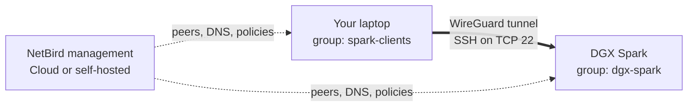

import { Note, Warning } from '@/components/mdx'

export const description =
  'Reach an NVIDIA DGX Spark from any network with NetBird. Install the CLI on DGX OS, SSH in over your NetBird network, and limit access with a policy.'

# Remote Access to NVIDIA DGX Spark

This guide shows how to reach an NVIDIA DGX Spark from any network with NetBird. You install NetBird on the Spark and on your laptop, SSH into the Spark using its NetBird DNS name, and then replace the Default policy with one that only allows SSH from your own devices. You don't need to open inbound ports or set up port forwarding on the Spark's network.

## What You'll Achieve



Both devices join your NetBird network and get a NetBird IP and DNS name. Traffic between them goes through an encrypted WireGuard tunnel, directly when possible and through a [relay](/about-netbird/understanding-nat-and-connectivity#net-bird-relay) when a direct connection is blocked. The management service, on NetBird Cloud or your [self-hosted](/selfhosted/selfhosted-quickstart) deployment, distributes peers, DNS names, and policies. Your SSH traffic does not pass through it.

## Prerequisites

- A DGX Spark running DGX OS, connected to the internet, with a user account that has `sudo` privileges. For the initial setup you need a local terminal or a LAN SSH session on it.
- A laptop or workstation (macOS, Windows, or Linux) to connect from.
- A [NetBird Cloud account](https://app.netbird.io) or a [self-hosted](/selfhosted/selfhosted-quickstart) deployment.
- An OpenSSH server on the Spark. Check whether it is running:

```bash
## Check if SSH is running
systemctl status ssh --no-pager
```

If it isn't, install and start it:

```bash
## Install OpenSSH server
sudo apt update
sudo apt install -y openssh-server

## Enable and start SSH service
sudo systemctl enable ssh --now --no-pager

## Verify SSH is running
systemctl status ssh --no-pager
```

## Step 1: Install NetBird on the DGX Spark

DGX OS is based on Ubuntu, so you install NetBird from the apt repository, as in the [Linux installation guide](/get-started/install/linux#ubuntu-debian-apt). The Spark is an arm64 machine and reports `aarch64`:

```bash
## Check the CPU architecture (DGX Spark reports aarch64)
uname -m
```

Add the repository and install the client:

```bash
## Update package list
sudo apt update

## Install required tools for adding external repositories
sudo apt install -y ca-certificates curl gnupg

## Add NetBird signing key
curl -fsSL https://pkgs.netbird.io/debian/public.key | \
  sudo gpg --dearmor --output /usr/share/keyrings/netbird-archive-keyring.gpg

## Add NetBird repository
echo 'deb [signed-by=/usr/share/keyrings/netbird-archive-keyring.gpg] https://pkgs.netbird.io/debian stable main' | \
  sudo tee /etc/apt/sources.list.d/netbird.list

## Update package list with new repository
sudo apt update

## Install NetBird
sudo apt install -y netbird
```

<Note>
The Linux desktop app (`netbird-ui`) is built for x86_64 only, so use the `netbird` CLI on the Spark. macOS and Windows devices, including arm64 ones, can use the desktop app.
</Note>

The package installs the `netbird` command and starts the NetBird service. Check that it is running:

```bash
## Check NetBird version
netbird version

## Check NetBird service status
sudo systemctl status netbird --no-pager

## Check NetBird connection status
sudo netbird status
```

The service should be `active (running)`, and the status should show `Daemon status: NeedsLogin`.

## Step 2: Connect the DGX Spark

You can register the Spark as a peer with a setup key or with SSO login. We recommend a setup key for the Spark, because peers added with a setup key are not affected by session expiration.

### Use a Setup Key

Sign in to the [NetBird dashboard](https://app.netbird.io). Your NetBird network is created on your first sign-in. Go to **Settings** → **Setup Keys**, click **Create Key**, and name the [setup key](/manage/peers/register-machines-using-setup-keys). Set **Auto-assigned groups** to `dgx-spark` so the Spark joins the group used in [Step 6](#step-6-restrict-access-with-a-policy). Keys are one-off by default, so turn on **Make this key reusable** if you plan to enroll more Sparks, or re-enroll this one, with the same key. Click **Create Setup Key**, copy the key, and run this on the Spark:

```bash
## Join the NetBird network with the setup key
sudo netbird up --setup-key <SETUP_KEY>
```

### Sign In with SSO

```bash
## Start NetBird and begin authentication
sudo netbird up

## If no browser opens on the hardware platform, open the URL it prints
## on any device and sign in. Choose Google, GitHub, Microsoft, or email.
```

See [Running NetBird with SSO Login](/get-started/install#running-net-bird-with-sso-login) for details.

<Note>
Peers added with SSO login are subject to [peer session expiration](/manage/settings/enforce-periodic-user-authentication), which new accounts enable with a 24-hour period. When the session expires, the Spark shows `Login required` on its page under **Peers** and drops off the network until someone runs `sudo netbird up` on it again. To avoid this, use a setup key or [disable expiration for the Spark](/manage/settings/enforce-periodic-user-authentication#disable-expiration-individually-per-peer).
</Note>

### Connect to a Self-Hosted Deployment

Add your management URL to either command. Without `--management-url`, a new installation connects to NetBird Cloud.

```bash
## Setup key
sudo netbird up --management-url https://<YOUR_NETBIRD_DOMAIN> --setup-key <SETUP_KEY>

## Browser login
sudo netbird up --management-url https://<YOUR_NETBIRD_DOMAIN>
```

When the command prints `Connected`, run `sudo netbird status` to see the Spark's NetBird IP and DNS name. The Spark also appears under **Peers** in the dashboard.

## Step 3: Connect Your Laptop

Install NetBird on the device you will connect from: [macOS](/get-started/install/macos), [Windows](/get-started/install/windows), or [Linux](/get-started/install/linux). Sign in with the **same account** you used for the Spark:

- In the desktop app, choose **Cloud** on first launch, or choose **Self-hosted** and enter your management URL. Then select **Connect** from the NetBird icon in the menu bar or system tray.
- On Linux, run `sudo netbird up` and complete the sign-in in your browser. Add `--management-url https://<YOUR_NETBIRD_DOMAIN>` if you self-host.

## Step 4: Verify Connectivity

On your laptop, ping the Spark and list the peers it can reach:

```bash
## Test ping to the hardware platform from a client (use the DNS name or IP from `sudo netbird status` on the hardware platform)
ping -c 5 <HARDWARE_HOSTNAME>.netbird.cloud

## List the peers this device can reach
netbird status -d
```

The pings should succeed and the Spark should show as `Connected`. With [lazy connections](/manage/peers/lazy-connection), the default on new accounts, a peer shows `Idle` until the first traffic, and some of the first pings can be lost while the connection comes up. If that happens, run the ping again.

In this guide, `<HARDWARE_HOSTNAME>` and `<NETBIRD_IP>` are the Spark's NetBird DNS label and IP, as shown by `sudo netbird status` on the Spark. Peer names end in `.netbird.cloud` on NetBird Cloud. Self-hosted deployments use the [DNS domain](/manage/dns#automatic-peer-domain-names) from your account settings, `.netbird.selfhosted` by default.

The ping works because new accounts have a **Default** policy that allows all traffic between peers. You replace it in [Step 6](#step-6-restrict-access-with-a-policy).

## Step 5: SSH into the DGX Spark

Use an existing SSH key, or generate one on your laptop:

```bash
## Generate new SSH key pair
ssh-keygen -t ed25519 -f ~/.ssh/netbird_remote

## Display public key to copy
cat ~/.ssh/netbird_remote.pub
```

On the Spark, add the public key to your user's `authorized_keys`:

```bash
## On the hardware platform, create the SSH directory if it does not exist
mkdir -p ~/.ssh

## Add the client's public key
echo "<YOUR_PUBLIC_KEY>" >> ~/.ssh/authorized_keys

## Set correct permissions
chmod 600 ~/.ssh/authorized_keys
chmod 700 ~/.ssh
```

From your laptop, connect over NetBird. To test the remote path, connect from a different network than the Spark's:

```bash
## Connect using the NetBird DNS name (preferred)
ssh -i ~/.ssh/netbird_remote <USERNAME>@<HARDWARE_HOSTNAME>.netbird.cloud

## Or connect using the NetBird IP address
ssh -i ~/.ssh/netbird_remote <USERNAME>@<NETBIRD_IP>
```

On the first connection, SSH asks you to confirm the Spark's host key. Type `yes` to continue.

`scp` and remote commands work the same way:

```bash
## Create a test file on the client device
echo "test file for remote access" > test.txt

## Test file transfer over SSH
scp -i ~/.ssh/netbird_remote test.txt <USERNAME>@<HARDWARE_HOSTNAME>.netbird.cloud:~/

## Verify you can run commands remotely
ssh -i ~/.ssh/netbird_remote <USERNAME>@<HARDWARE_HOSTNAME>.netbird.cloud 'nvidia-smi'
```

## Step 6: Restrict Access with a Policy

The Default policy lets every peer in your network reach every other peer on any port. Replace it with a policy that only lets your own devices reach the Spark over SSH. For background, see [Groups and Access Policies](/manage/access-control) and [Managing Policies](/manage/access-control/manage-network-access#managing-policies).

<Warning>
Create and test the new policy before you disable the Default policy. With no policy, peers cannot reach each other. Keep a local or LAN session open on the Spark until you have confirmed that SSH over NetBird still works.
</Warning>

1. Go to **Peers**, select the Spark, and under **Assigned Groups** add a new group named `dgx-spark`, then click **Save Changes**. Skip this if your setup key already assigns the group.
2. Add each device you connect from to a new group named `spark-clients`.
3. Go to **Access Control** → **Policies** and click **Add Policy**.
4. Set **Source** to `spark-clients`, **Destination** to `dgx-spark`, **Protocol** to `TCP`, and **Ports** to `22`.
5. Name the policy, for example `SSH to DGX Spark`, and save it.
6. Disable the **Default** policy with the switch in the **Active** column.

Run the SSH test from [Step 5](#step-5-ssh-into-the-dgx-spark) again. All other traffic between your peers is now blocked. That includes `ping`, which needs its own ICMP policy.

<Note>
Instead of adding each laptop to `spark-clients`, you can assign the group to users, and the devices they sign in on inherit it. See [User Groups](/manage/access-control#user-groups).
</Note>

## Reach Services Running on the Spark

To open a web UI or API on the Spark, such as a notebook server or an inference endpoint, forward its port over SSH. This works with the policy from Step 6 and with services that only listen on `localhost`:

```bash
ssh -i ~/.ssh/netbird_remote -L 8888:localhost:<LOCAL_PORT> <USERNAME>@<HARDWARE_HOSTNAME>.netbird.cloud
```

Then open `http://localhost:8888` on your laptop.

If the service listens on all interfaces (`0.0.0.0`), you can instead add its port to the policy's **Ports** field next to `22` and open `http://<HARDWARE_HOSTNAME>.netbird.cloud:<PORT>` directly. A policy only controls traffic that arrives over NetBird, so the service is also reachable from the Spark's local network.

## Use NetBird SSH

Instead of managing OpenSSH keys, you can use [NetBird SSH](/manage/peers/ssh). The NetBird client on the Spark runs its own SSH server and authenticates each session against your identity provider (JWT authentication, the default). A `NetBird SSH` policy decides which users can log in as which local users.

Once NetBird SSH is enabled, SSH connections that reach the Spark over NetBird on port 22 go to the NetBird SSH server instead of OpenSSH, and your `authorized_keys` no longer applies to them. The SSH server has to be enabled on the Spark and allowed by a `NetBird SSH` policy in the dashboard. It requires NetBird v0.61.0 or later on both devices (check with `netbird version`).

1. Enable the SSH server on the Spark:

   ```bash
   sudo netbird down  # if NetBird is already running
   sudo netbird up --allow-server-ssh
   ```

   To use `scp` or `sftp`, also pass `--enable-ssh-sftp`. For port forwarding, pass `--enable-ssh-local-port-forwarding`. See the [flag reference](/manage/peers/ssh#step-1-enable-ssh-server-on-target-peer).

2. In the dashboard, go to **Access Control** → **Policies** and click **Add Policy**. You can also click **Create SSH Policy** in the **SSH Access** section of the Spark's page under **Peers**, which opens the same form. Set:
   - **Protocol**: `NetBird SSH`
   - **Source**: the [user group](/manage/access-control#user-groups) whose members should log in
   - **Destination**: `dgx-spark`
   - **SSH Access**: **Limited Access** to map the source group to your local user on the Spark, or **Full Access** to allow any local user. See [Fine-Grained Access Control](/manage/peers/ssh#fine-grained-access-control).

3. Disable the `TCP` port `22` policy from [Step 6](#step-6-restrict-access-with-a-policy), so that the `NetBird SSH` policy is the only rule that grants SSH access to the Spark. This matters most on peers where SSH was turned on with the older per-peer **SSH Access** toggle: there, a `TCP` port `22` policy also lets its source peers log in through NetBird SSH as any local user, and **Limited Access** is not enforced.

4. From your laptop, connect with OpenSSH or the NetBird CLI. Each new session prints a URL where you sign in with your identity provider:

   ```bash
   ssh <USERNAME>@<HARDWARE_HOSTNAME>.netbird.cloud
   # or
   netbird ssh <USERNAME>@<HARDWARE_HOSTNAME>.netbird.cloud
   ```

A few things to keep in mind:

- Unless you set `--ssh-jwt-cache-ttl` on your laptop, every new SSH, `scp`, or port-forwarding session asks you to sign in again. See [token caching](/manage/peers/ssh#jwt-authentication-default) and the limits in the [CLI reference](/get-started/cli#flags).
- Without `--enable-ssh-sftp` on the Spark, `scp` and `sftp` fail, for example with `scp: Connection closed`, or hang. `scp -O`, which uses the legacy SCP protocol, works without the flag.
- Without `--enable-ssh-local-port-forwarding` on the Spark, a forward fails with `administratively prohibited`. With the flag, both `ssh -L` and `netbird ssh -L` work.
- JWT validation needs the Spark's system clock to be in sync. Clock skew causes authentication failures.
- With NetBird SSH enabled, an admin can also open a terminal on the Spark from the dashboard with the [Browser Client](/manage/peers/browser-client#ssh-connection).
- To switch back to OpenSSH, run `sudo netbird down && sudo netbird up --allow-server-ssh=false`.

<Warning>
Do not start the Spark with `--disable-ssh-auth` unless it is on an isolated network. Without JWT authentication, anyone whose peer the policy allows can log in as any local user, without a password or key. The setting is saved, so a later `sudo netbird up --allow-server-ssh` keeps authentication off. To turn it back on, run `sudo netbird down && sudo netbird up --allow-server-ssh --disable-ssh-auth=false`.
</Warning>

## Remove NetBird from the Spark

Removing the package also stops and uninstalls the NetBird service, but it leaves the Spark's NetBird identity in `/var/lib/netbird`. Delete that directory too, or a later reinstall rejoins your network as the same peer without authenticating. After you delete it, the Spark has to authenticate again to rejoin, and it gets a new NetBird IP.

```bash
## Disconnect from the NetBird network
sudo netbird down

## Remove NetBird package (this also stops and removes the NetBird service)
sudo apt remove --purge -y netbird

## Remove the device identity and logs, which the package leaves behind
sudo rm -rf /var/lib/netbird /var/log/netbird

## Remove repository and keys (optional)
sudo rm /etc/apt/sources.list.d/netbird.list
sudo rm /usr/share/keyrings/netbird-archive-keyring.gpg

## Update package list
sudo apt update
```

Also delete the Spark under **Peers** in the dashboard. If the old entry stays, a reinstalled Spark registers as a new peer with a suffixed DNS name, such as `<HARDWARE_HOSTNAME>-169-66`. It also loses any groups you assigned by hand. If your setup key assigns `dgx-spark`, the Spark rejoins that group automatically; otherwise add it again after reinstalling, or the Step 6 policy no longer covers it.

## Troubleshooting

| Symptom | Cause | Fix |
|---------|-------|-----|
| `netbird up` waits and no browser opens | No browser on the Spark | Open the printed URL on any device, or use a [setup key](#use-a-setup-key) |
| `netbird up` fails to authenticate | Management service unreachable | Check internet access, then run `curl -I https://api.netbird.io` or the same against your self-hosted management URL. Any HTTP response, including `404`, means the endpoint is reachable |
| Peers are missing from `netbird status -d` | Different accounts or management URLs | Sign in with the same account, and the same management URL if you self-host, on every device |
| Spark drops off after a day and shows `Login required` on its page under **Peers** | Session expired after an SSO login | Run `sudo netbird up` on the Spark, then rejoin it with a setup key or disable session expiration for it ([Step 2](#step-2-connect-the-dgx-spark)) |
| Peer is connected but SSH times out | No policy allows TCP 22 between the devices | Check **Access Control** → **Policies** and the groups of both peers |
| `ping` fails but SSH works | The policy only allows TCP 22 | Expected after Step 6. Add an ICMP policy if you need `ping` |
| SSH connection refused | OpenSSH server not running on the Spark | Run `sudo systemctl start ssh --no-pager` on the Spark |
| SSH authentication failure with OpenSSH keys | Key missing, or NetBird SSH is enabled | Check `~/.ssh/authorized_keys` on the Spark. If NetBird SSH is on, see [NetBird SSH troubleshooting](/manage/peers/ssh#troubleshooting) |
| `REMOTE HOST IDENTIFICATION HAS CHANGED` after enabling NetBird SSH | The laptop saved the Spark's OpenSSH host key, and NetBird's SSH configuration isn't applied (for example with `--disable-ssh-auth`) | Remove the old key with `ssh-keygen -R <HARDWARE_HOSTNAME>.netbird.cloud` |
| Cannot resolve the NetBird DNS name | DNS resolution issue on the laptop | Use the NetBird IP from `netbird status -d`, and see [DNS troubleshooting](/manage/dns/troubleshooting) |

For connection types, relays, and debug bundles, see [Troubleshooting Client Issues](/help/troubleshooting-client).
