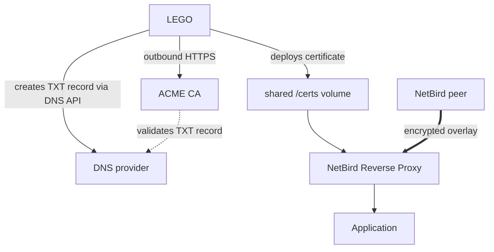

import {Note} from "@/components/mdx"

export const description =
    'Expose internal services over HTTPS with publicly trusted certificates and no public inbound ports by pairing the NetBird Reverse Proxy with a LEGO DNS-01 challenge.'

# NetBird Reverse Proxy with LEGO DNS Challenge

Expose internal services over HTTPS with trusted certificates, without opening a single inbound port to the internet.

By combining the NetBird Reverse Proxy with [LEGO](https://go-acme.github.io/lego/), you can securely publish private applications using publicly trusted TLS certificates while keeping your infrastructure completely private. Your reverse proxy stays behind NAT or a restrictive firewall, and only authorized NetBird peers can access the service.

This approach is ideal for admin consoles, internal APIs, development environments, and homelab services. Throughout this guide, we'll use an internal Grafana dashboard as an example, making it available at `https://grafana.proxy.example.com` exclusively to devices connected to your NetBird network.

LEGO makes this possible by using the ACME `dns-01` challenge. The proxy's built-in ACME client relies on `tls-alpn-01` or `http-01`, both of which require the certificate authority to reach your proxy on public port 443 or 80. With `dns-01`, LEGO instead temporarily creates a DNS TXT record through your DNS provider's API. Once the certificate authority verifies the DNS record, your certificate is issued automatically. No public ports, firewall changes, or inbound connectivity required.

The result is a simple, secure deployment that combines:

- **Publicly trusted HTTPS certificates** for a seamless user experience with no browser warnings.
- **Zero public inbound exposure**, keeping your services private.
- **Automatic certificate issuance and renewal** using your DNS provider's API.
- **Full compatibility with the NetBird Reverse Proxy**, allowing only authorized NetBird peers to reach your applications.

With LEGO handling certificate management, you can confidently expose internal services over HTTPS while preserving the security benefits of a private, Zero Trust network.

<Note>
    This is the full Docker Compose walkthrough of the pattern introduced in [Private Proxy Without Public Inbound Ports](/use-cases/security/private-no-inbound). If you just need the concept and a minimal static-certificate setup, start there.
</Note>

There are four pieces working together here:

- LEGO obtains and renews a wildcard certificate with `dns-01`.
- LEGO deploys the certificate and key into a directory shared with the proxy.
- The proxy loads the wildcard certificate and hot-reloads it after renewal.
- `NB_PROXY_PRIVATE=true` and **NetBird-Only Access** keep the service on the NetBird overlay. No Docker ports or public ingress routes expose the proxy.



Do note that a publicly trusted certificate doesn't make the service public. Reachability is controlled separately by NetBird's private DNS records, overlay routing, access groups, and the fact that there's no public listener.

<Note>
    One misunderstanding causes most failed private deployments: assuming `NB_PROXY_PRIVATE=true` alone makes the proxy private. It enables the proxy's per-account listeners on the NetBird overlay; it doesn't disable the ordinary proxy listener or remove an existing ingress route. This example also binds that listener to `127.0.0.1`, publishes no Docker ports, and assumes Traefik, Caddy, NGINX, or another public proxy isn't routing to the container.
</Note>

## How this differs from a private service with built-in certificates

These are complementary controls, not competing ways to make a service private:

- **NetBird-Only Access** controls who can reach the application. It identifies peers through NetBird, applies the service's access groups, and carries authorized traffic over the encrypted overlay.
- **Built-in ACME or LEGO** controls how the proxy obtains its publicly trusted TLS certificate. It doesn't grant a peer access to the application.

In both designs, you configure the service as private and assign the appropriate NetBird groups. The difference is the certificate-validation path:

| Consideration | Private service + NetBird built-in ACME | Private service + LEGO DNS-01 |
| --- | --- | --- |
| Client access | Authorized NetBird peers only | Authorized NetBird peers only |
| Let's Encrypt validation | The CA connects inbound to public port 443 for `tls-alpn-01`, or port 80 for `http-01` | LEGO makes outbound API calls and creates a temporary public DNS TXT record |
| Public proxy path | A challenge listener and its public DNS/ingress path must remain reachable for issuance and renewal | No proxy port or ingress route needs to be public |
| Certificate lifecycle | The NetBird proxy requests and renews certificates for service hostnames | LEGO requests and renews a wildcard certificate, then deploys it through a hook and shared volume |
| Adding a service | Its hostname may need a new certificate issuance | A matching one-label hostname can use the existing wildcard immediately |
| Operational cost | Fewer components and no DNS API credential | Requires a scoped DNS token, persistent LEGO state, a renewal schedule, and the deployment hook |
| Certificate exposure | Each exact hostname on a publicly trusted certificate is submitted to Certificate Transparency logs | The wildcard and base domain are logged, but the individual service names covered by the wildcard are not enumerated there |
| Key scope | A compromised hostname-specific key has a narrower scope | A compromised wildcard key can impersonate every matching one-label hostname |

Use the built-in option when exposing the ACME challenge port is acceptable and you prefer the simplest lifecycle. Add LEGO when the host is behind NAT, policy forbids all public inbound traffic, or you want one wildcard to cover many private services. Do note that LEGO replaces the public ACME challenge path; it does **not** replace NetBird-Only Access.

## Before you begin

Before diving in, you'll need a few things:

- A NetBird proxy token and the address of your NetBird management service. For NetBird Cloud, create an account-scoped token by following the [Bring Your Own Proxy guide](/manage/reverse-proxy/bring-your-own-proxy).
- A domain you control, such as `proxy.example.com`.
- A DNS provider supported by [LEGO](https://go-acme.github.io/lego/dns/), plus an API credential that can edit TXT records in that zone.
- Docker with the Compose plugin.
- A current NetBird Reverse Proxy image that supports `NB_PROXY_WILDCARD_CERT_DIR` and `NB_PROXY_PRIVATE`.

The example below uses Cloudflare. If you're on another provider, replace `cloudflare` and use the credential variables listed on that provider's LEGO page.

For a fully private deployment, the proxy domain doesn't need a public `A` or `AAAA` record pointing to the proxy host. DNS-01 only needs permission to create the public `_acme-challenge` TXT record. When you enable NetBird-Only Access on a service, NetBird gives authorized peers a private record that points the service hostname to the proxy's NetBird address.

<Note>
    Public certificate authorities submit issued names to Certificate Transparency logs. Use a private CA instead if even the wildcard domain name must remain confidential; its root certificate must then be trusted by every client.
</Note>

## Configure LEGO and the proxy

For a **new proxy deployment**, go ahead and create a dedicated directory on the host where Docker will run LEGO and the NetBird proxy, then run the remaining commands from it. For example:

```bash
mkdir -p ~/netbird-lego-proxy
cd ~/netbird-lego-proxy
```

When you're done, the directory will look like this:

```text
netbird-lego-proxy/
├── .env
├── compose.yaml
├── deploy-certificate.sh
└── secrets/
    └── cloudflare_dns_api_token
```

The `.env` file must sit beside `compose.yaml` because Docker Compose reads it from the project directory to substitute values such as `PROXY_DOMAIN` and `NB_PROXY_TOKEN`. It's a host file; don't create it inside either container.

For an **existing self-hosted NetBird deployment**, don't create a second Compose project and don't replace the stack's existing `.env` or Compose file. Work in the directory where `docker compose ps` shows the current NetBird services, and add the LEGO files and settings to that project by following [Existing self-hosted deployment](#existing-self-hosted-deployment) below.

### 1. Add the deployment values

For a new deployment, create `.env` in that directory:

```bash
PROXY_DOMAIN=proxy.example.com
ACME_EMAIL=admin@example.com
NB_PROXY_MANAGEMENT_ADDRESS=https://api.netbird.io
NB_PROXY_TOKEN=nbx_replace_with_your_proxy_token
```

This file contains your proxy token, so go ahead and lock it down:

```bash
chmod 600 .env
```

For an existing self-hosted project, keep its current `.env` as is. Add `PROXY_DOMAIN` and `ACME_EMAIL` only if they're not already defined for Compose interpolation, using the same domain as the existing proxy:

```bash
PROXY_DOMAIN=proxy.example.com
ACME_EMAIL=admin@example.com
```

Keep the existing management address and proxy token wherever the current proxy reads them, commonly `proxy.env`. Don't copy a token into a second file unless the existing Compose configuration actually interpolates it from `.env`.

For self-hosted NetBird, replace `NB_PROXY_MANAGEMENT_ADDRESS` with the URL of your management service. Use an HTTPS endpoint whenever the connection leaves a private Docker network.

### 2. Add the DNS API credential

First, create a dedicated, least-privilege Cloudflare API token. Don't use the Global API Key or an Origin CA key here.

1. Sign in to the [Cloudflare dashboard](https://dash.cloudflare.com/).
2. For a user token, open **My Profile > API Tokens**. For an account-owned service token, open **Manage Account > API Tokens**.
3. Select **Create Token**, then use the **Edit zone DNS** template or select **Create Custom Token**.
4. Give the token a descriptive name, such as `LEGO DNS-01 - example.com`.
5. Configure these two zone permissions:
   - **Zone > DNS > Edit**
   - **Zone > Zone > Read**
6. Under **Zone Resources**, select **Include > Specific zone > example.com**. Don't grant access to every zone unless this LEGO deployment manages all of them.
7. Optionally set a short expiration or restrict the token to the proxy host's public source IP. Do note that an IP restriction must continue to match during every renewal.
8. Select **Continue to summary**, review the scope, and select **Create Token**. Copy the secret immediately; Cloudflare only displays it once.

These are the permissions recommended by [LEGO's Cloudflare provider](https://go-acme.github.io/lego/dns/cloudflare/): DNS edit access lets LEGO create and remove the challenge TXT record, while zone read access lets it resolve the domain to Cloudflare's internal zone ID. Cloudflare documents the complete token flow in [Create API token](https://developers.cloudflare.com/fundamentals/api/get-started/create-token/).

Now create the secret file. This approach keeps the token out of your shell history:

```bash
install -d -m 700 secrets
read -rsp "Cloudflare API token: " CF_LEGO_TOKEN
printf '%s' "$CF_LEGO_TOKEN" > secrets/cloudflare_dns_api_token
unset CF_LEGO_TOKEN
chmod 700 secrets
chmod 600 secrets/cloudflare_dns_api_token
```

The file must contain only the token. You can verify that Cloudflare recognizes it before starting LEGO:

```bash
CF_LEGO_TOKEN="$(<secrets/cloudflare_dns_api_token)"
curl -fsS https://api.cloudflare.com/client/v4/user/tokens/verify \
  --header "Authorization: Bearer $CF_LEGO_TOKEN"
unset CF_LEGO_TOKEN
```

The response should contain `"success": true` and `"status": "active"`. This check validates the token itself; LEGO's first DNS-01 run also confirms that its zone scope and both permissions are correct.

The proxy never receives this credential. It's mounted only into the LEGO container. LEGO supports the `_FILE` suffix, so `CF_DNS_API_TOKEN_FILE` reads the token from the mounted Docker secret instead of placing the value directly in the container environment.

### 3. Add the certificate deployment hook

Create `deploy-certificate.sh`:

```sh
#!/bin/sh
set -eu

: "${LEGO_HOOK_CERT_PATH:?LEGO did not provide a certificate path}"
: "${LEGO_HOOK_CERT_KEY_PATH:?LEGO did not provide a key path}"

cert_tmp="$(mktemp /certs/.wildcard.crt.XXXXXX)"
key_tmp="$(mktemp /certs/.wildcard.key.XXXXXX)"

cleanup() {
    if [ -n "${cert_tmp:-}" ]; then rm -f "$cert_tmp"; fi
    if [ -n "${key_tmp:-}" ]; then rm -f "$key_tmp"; fi
}
trap cleanup EXIT HUP INT TERM

cp "$LEGO_HOOK_CERT_PATH" "$cert_tmp"
cp "$LEGO_HOOK_CERT_KEY_PATH" "$key_tmp"

# The NetBird Reverse Proxy image runs as UID/GID 1000.
chown 1000:1000 /certs "$cert_tmp" "$key_tmp"
chmod 750 /certs
chmod 644 "$cert_tmp"
chmod 600 "$key_tmp"

# Move the key first and the certificate last. The proxy watches these names,
# debounces the two filesystem events, and reloads the complete pair.
mv -f "$key_tmp" /certs/wildcard.key
key_tmp=""
mv -f "$cert_tmp" /certs/wildcard.crt
cert_tmp=""
```

Make the hook executable:

```bash
chmod 755 deploy-certificate.sh
```

LEGO v5 provides the issued file locations through the `LEGO_HOOK_CERT_PATH` and `LEGO_HOOK_CERT_KEY_PATH` variables. The hook copies only the full certificate chain and its matching private key into the proxy's certificate directory. This avoids exposing LEGO's ACME account data to the proxy and avoids placing LEGO's separate issuer certificate in the wildcard scan directory.

### 4. Add or update Docker Compose

#### New standalone proxy deployment

If this host isn't already part of a self-hosted NetBird Compose project, create `compose.yaml`:

```yaml
services:
  lego:
    image: goacme/lego:v5
    environment:
      CF_DNS_API_TOKEN_FILE: /run/secrets/cloudflare_dns_api_token
    secrets:
      - cloudflare_dns_api_token
    volumes:
      - lego_state:/var/lib/lego
      - proxy_certs:/certs
      - ./deploy-certificate.sh:/hooks/deploy-certificate.sh:ro
    command:
      - run
      - --accept-tos
      - --email
      - ${ACME_EMAIL:?set ACME_EMAIL in .env}
      - --dns
      - cloudflare
      - --domains
      - ${PROXY_DOMAIN:?set PROXY_DOMAIN in .env}
      - --domains
      - "*.${PROXY_DOMAIN:?set PROXY_DOMAIN in .env}"
      - --path
      - /var/lib/lego
      - --deploy-hook
      - /hooks/deploy-certificate.sh
    restart: "no"

  netbird-proxy:
    image: netbirdio/reverse-proxy:latest
    depends_on:
      lego:
        condition: service_completed_successfully
    environment:
      NB_PROXY_MANAGEMENT_ADDRESS: ${NB_PROXY_MANAGEMENT_ADDRESS:?set NB_PROXY_MANAGEMENT_ADDRESS in .env}
      NB_PROXY_TOKEN: ${NB_PROXY_TOKEN:?set NB_PROXY_TOKEN in .env}
      NB_PROXY_DOMAIN: ${PROXY_DOMAIN:?set PROXY_DOMAIN in .env}

      # Serve private services on the proxy's embedded NetBird interface.
      NB_PROXY_PRIVATE: "true"

      # Keep the ordinary container listener local. Private overlay listeners
      # use ports 80 and 443 independently of this address.
      NB_PROXY_ADDRESS: 127.0.0.1:8443

      # Enable wildcard certificate mode. Matching names use the certificate
      # deployed by LEGO and bypass the proxy's built-in ACME issuance.
      NB_PROXY_ACME_CERTIFICATES: "true"
      NB_PROXY_CERTIFICATE_DIRECTORY: /certs
      NB_PROXY_WILDCARD_CERT_DIR: /certs

      # A wildcard covers one label, such as grafana.proxy.example.com, but not
      # proxy.example.com or one.two.proxy.example.com.
      NB_PROXY_REQUIRE_SUBDOMAIN: "true"
      NB_PROXY_LOG_LEVEL: info
    volumes:
      - proxy_certs:/certs
    restart: unless-stopped

secrets:
  cloudflare_dns_api_token:
    file: ./secrets/cloudflare_dns_api_token

volumes:
  lego_state:
  proxy_certs:
```

#### Existing self-hosted deployment

Keep the current management, signal, relay, dashboard, database, and ingress services. If the stack already has a proxy service, change only that service and add LEGO to the same Compose project. If it doesn't have a proxy yet, merge both services from the standalone example into the current project and connect the proxy to the existing management service and Docker network; the [Enable Reverse Proxy guide](/selfhosted/migration/enable-reverse-proxy) documents those self-hosted dependencies.

First, identify the existing proxy service name and certificate volume:

```bash
docker compose config --services
docker compose config | less
```

When a proxy is already present, the standard self-hosted Compose files usually call it `proxy` and its certificate volume `netbird_proxy_certs`; customized deployments may use different names. A named volume is scoped to its Compose project, so LEGO and the proxy must reference the **same existing volume key**. Don't create a similarly named volume in a separate Compose project.

Add the `lego` service from the new-deployment example to the existing `services:` map. Change its certificate mount from `proxy_certs:/certs` to the volume already mounted at `/certs` by the proxy. For the standard names, the merged parts look like this:

```yaml
services:
  # Keep all existing services.
  lego:
    image: goacme/lego:v5
    environment:
      CF_DNS_API_TOKEN_FILE: /run/secrets/cloudflare_dns_api_token
    secrets:
      - cloudflare_dns_api_token
    volumes:
      - lego_state:/var/lib/lego
      - netbird_proxy_certs:/certs
      - ./deploy-certificate.sh:/hooks/deploy-certificate.sh:ro
    command:
      - run
      - --accept-tos
      - --email
      - ${ACME_EMAIL:?set ACME_EMAIL in .env}
      - --dns
      - cloudflare
      - --domains
      - ${PROXY_DOMAIN:?set PROXY_DOMAIN in .env}
      - --domains
      - "*.${PROXY_DOMAIN:?set PROXY_DOMAIN in .env}"
      - --path
      - /var/lib/lego
      - --deploy-hook
      - /hooks/deploy-certificate.sh
    restart: "no"

  proxy:
    image: netbirdio/reverse-proxy:latest # Keep the existing pinned image/tag.
    # Also keep the existing networks, management dependency, env_file,
    # logging, and every other deployment-specific setting.
    volumes:
      - netbird_proxy_certs:/certs

secrets:
  # Keep existing secrets and add this one.
  cloudflare_dns_api_token:
    file: ./secrets/cloudflare_dns_api_token

volumes:
  # Keep all existing volume declarations, including netbird_proxy_certs.
  lego_state:
  netbird_proxy_certs:
```

The fragment illustrates merge points; it's not a replacement for the full self-hosted Compose file. YAML keys can appear only once, so merge these entries under the existing `services:`, `secrets:`, and `volumes:` maps rather than adding a second copy of those sections.

Next, update the existing proxy's configuration source. If it uses `env_file: ./proxy.env`, replace the conflicting lines in `proxy.env`; if it uses a Compose `environment:` map, change them there:

```bash
NB_PROXY_PRIVATE=true
NB_PROXY_ADDRESS=127.0.0.1:8443
NB_PROXY_ACME_CERTIFICATES=true
NB_PROXY_CERTIFICATE_DIRECTORY=/certs
NB_PROXY_WILDCARD_CERT_DIR=/certs
NB_PROXY_REQUIRE_SUBDOMAIN=true
NB_PROXY_LOG_LEVEL=info
```

Don't append duplicate variables: replace existing values such as `NB_PROXY_ADDRESS=:8443`. Preserve the current `NB_PROXY_DOMAIN`, `NB_PROXY_TOKEN`, `NB_PROXY_MANAGEMENT_ADDRESS`, internal Docker network, and management-service dependency.

To make this proxy cluster fully private, remove only the public routing to the proxy: its host `ports:`, generic Traefik TCP passthrough labels, or the equivalent Caddy, NGINX, or load-balancer route. Don't remove the main NetBird ingress if the dashboard and management API still use it. Proxy Protocol settings such as `NB_PROXY_PROXY_PROTOCOL` and `NB_PROXY_TRUSTED_PROXIES` can also be removed when no ingress proxy connects to this listener.

Validate the merged configuration, issue the initial certificate, and then recreate only the proxy service. Replace `proxy` below if your service has a different name:

```bash
docker compose config --quiet
docker compose run --rm lego
docker compose up -d --no-deps --force-recreate proxy
```

Don't recreate the proxy until the LEGO command succeeds and the shared volume contains `wildcard.crt` and `wildcard.key`.

If the existing cluster must continue serving any public services, leave its public ingress in place; adding LEGO alone doesn't make it private. To operate public and zero-inbound private services at the same time, use a separate proxy cluster, domain, and token for the private services.

For a multi-host proxy cluster, a local Docker named volume isn't shared between hosts. Run one LEGO issuer and place `/certs` on a shared filesystem, or securely distribute each renewed certificate pair to every replica. Don't let every replica independently issue the same wildcard certificate.

Pin both images to tested patch versions in production. This example follows LEGO v5 syntax, where `run` comes before its flags. If you use LEGO v4, follow the [v4-to-v5 migration guide](https://go-acme.github.io/lego/migration/) when adapting commands and hook variables. If you reuse an existing LEGO v4 storage directory, LEGO requires a one-time storage migration before any other v5 command, because both the directory structure and the JSON file contents changed:

```bash
docker compose run --rm lego migrate --path /var/lib/lego
```

There's intentionally no `ports:` section. The proxy connects outbound to the management service and accepts private service traffic on its embedded NetBird interface. Keep host firewall rules for public ports 80 and 443 closed as a second layer of protection.

If you're adapting an existing public deployment, also remove any Traefik labels, Caddy or NGINX upstream, load-balancer target, and host networking that routes public traffic to the proxy. Do note that having no Compose `ports:` entry isn't sufficient when another container can reach the proxy over a shared Docker network.

Keep `NB_PROXY_LOG_LEVEL` at `info` in production. Debug logs can include full service mappings and sensitive upstream authorization header values.

## Start the private proxy

With everything in place, go ahead and start the stack:

```bash
docker compose up -d
```

Compose runs LEGO first. LEGO creates the DNS-01 challenge, obtains the certificate, runs the deployment hook, and exits successfully. The proxy starts only after the initial `wildcard.crt` and `wildcard.key` files are available.

Review both services' logs:

```bash
docker compose logs lego
docker compose logs netbird-proxy
```

The proxy log should report that it loaded a wildcard certificate for `*.proxy.example.com`, is watching `/certs`, and enabled private inbound listeners. In the NetBird dashboard, open **Reverse Proxy > Clusters** and confirm that the cluster is online and shows the **Private** capability. If you see all that, you're good to go.

Only the `netbird-proxy` container registers with NetBird; the LEGO helper won't appear in the dashboard. Replicas that use the same `NB_PROXY_TOKEN` and `NB_PROXY_DOMAIN` appear as one cluster with a connected-proxy count rather than as separate cluster rows.

## Create a NetBird-only service

Now let's publish the Grafana dashboard from our running example:

1. Open **Reverse Proxy > Services** and add an HTTP service.
2. Use a single-label subdomain covered by the certificate: `grafana` for `grafana.proxy.example.com`.
3. Select this proxy cluster and point the application target at the Grafana instance.
4. On the **Authentication** tab, enable [NetBird-Only Access](/manage/reverse-proxy/authentication#net-bird-only-access-private-services).
5. Select one or more access groups and save the service.

NetBird sends the private service DNS record only to peers allowed by those groups. The record points to the embedded proxy peer, where the private HTTPS listener accepts the connection over the NetBird overlay.

Do note that NetBird-Only Access is available for HTTP services. For TCP, UDP, or TLS passthrough services, use the access controls appropriate for those service modes.

## Automate certificate renewal

LEGO's `run` command obtains a missing certificate or renews an existing one when it becomes eligible. Schedule the same one-shot Compose service once or twice a day. For example, from the host's crontab:

```text
37 3 * * * cd /opt/netbird-private-proxy && /usr/bin/docker compose run --rm lego >> /var/log/netbird-lego.log 2>&1
```

Use the absolute path to your deployment and choose a non-midnight start time. LEGO also adds a small randomized delay for automated renewals. The deployment hook runs only after a certificate is issued or renewed, and the proxy hot-reloads the updated pair without a restart.

Back up the `lego_state` volume. It contains the ACME account and certificate state required for reliable renewals.

## Verify the result

From an authorized NetBird peer:

```bash
getent hosts grafana.proxy.example.com
curl -v https://grafana.proxy.example.com/
```

The hostname should resolve to a NetBird address and `curl` should validate the certificate without `-k`. From a device outside the NetBird network, the Grafana dashboard should have no usable public address and no reachable public listener.

Also test with a NetBird peer outside the selected access groups. It shouldn't receive access to the private service.

## Why all three certificate settings are used

| Setting | Purpose |
| --- | --- |
| `NB_PROXY_ACME_CERTIFICATES=true` | Activates the proxy certificate manager that supports wildcard certificate directories. |
| `NB_PROXY_CERTIFICATE_DIRECTORY=/certs` | Selects the shared certificate/cache directory. |
| `NB_PROXY_WILDCARD_CERT_DIR=/certs` | Loads matching `.crt`/`.key` pairs, extracts wildcard SANs, and selects them by SNI. |

For a domain covered by the loaded wildcard, the proxy serves LEGO's certificate and skips built-in issuance. An unmatched domain falls back to the proxy's built-in ACME client. That fallback can't complete while the proxy is fully private, so every service name must match one of the externally issued wildcards. `NB_PROXY_REQUIRE_SUBDOMAIN=true` prevents use of the bare cluster domain, but custom domains still need their own matching certificate pair.

If you only need one externally managed certificate and don't want any ACME fallback, use static certificate mode instead:

```yaml
NB_PROXY_ACME_CERTIFICATES: "false"
NB_PROXY_CERTIFICATE_DIRECTORY: /certs
NB_PROXY_CERTIFICATE_FILE: wildcard.crt
NB_PROXY_CERTIFICATE_KEY_FILE: wildcard.key
```

Remove `NB_PROXY_WILDCARD_CERT_DIR` in static mode. The same shared volume, deployment hook, renewal schedule, and hot-reload behavior still apply. [Private Proxy Without Public Inbound Ports](/use-cases/security/private-no-inbound) walks through that static-certificate variant.

## Troubleshooting

- **The proxy exits with `no .crt files found`:** LEGO didn't issue the initial certificate or its hook didn't deploy it. Check the LEGO log before starting the proxy.
- **The proxy can't read the private key:** confirm the hook completed and the files are owned by UID/GID 1000, with the key readable by that user.
- **A service remains certificate-pending:** confirm its hostname is exactly one label below the wildcard. `*.proxy.example.com` covers `grafana.proxy.example.com`, not `proxy.example.com` or `one.two.proxy.example.com`.
- **DNS-01 validation times out:** verify the provider name, credential variable, zone permissions, and authoritative DNS propagation. See LEGO's [DNS-01 guide](https://go-acme.github.io/lego/obtain/dns01/).
- **Clients report an untrusted issuer:** make sure the Compose command uses the production ACME server. Certificates from Let's Encrypt's staging service are intentionally untrusted.
- **A renewed certificate isn't served:** look for a certificate reload message in the proxy log and confirm the hook replaced both `wildcard.crt` and `wildcard.key` in the shared volume.
- **The service is still reachable publicly:** `NB_PROXY_PRIVATE` doesn't disable the ordinary listener. Confirm it's bound to loopback, Docker has no host port binding, and no ingress proxy or load balancer still routes to the container.

## Recap

The whole setup in one breath, mapped onto the Grafana example:

- LEGO proves ownership of `proxy.example.com` through a DNS TXT record and obtains a wildcard certificate. No inbound connection ever reaches the host.
- A deploy hook drops the certificate and key into a volume shared with the proxy, and the proxy hot-reloads them on every renewal.
- The proxy runs with `NB_PROXY_PRIVATE=true`, no published ports, and its ordinary listener bound to loopback, so its only inbound path is the NetBird overlay.
- The Grafana service uses NetBird-Only Access, so only peers in the selected access groups can resolve and reach `grafana.proxy.example.com`, and they get a browser-trusted certificate when they do.

## Related documentation

- [Private Proxy Without Public Inbound Ports](/use-cases/security/private-no-inbound): the concise static-certificate variant of this setup
- [Bring Your Own Proxy](/manage/reverse-proxy/bring-your-own-proxy): account-scoped proxy tokens and cluster registration
- [Reverse Proxy authentication and NetBird-Only Access](/manage/reverse-proxy/authentication)
- [LEGO: DNS providers](https://go-acme.github.io/lego/dns/)
- [LEGO: Obtain or renew certificates](https://go-acme.github.io/lego/usage/cli/renew-a-certificate/)
- [LEGO: Automatic renewal guidance](https://go-acme.github.io/lego/advanced/tips/)
